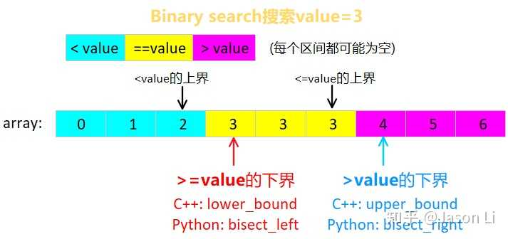
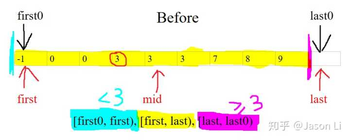
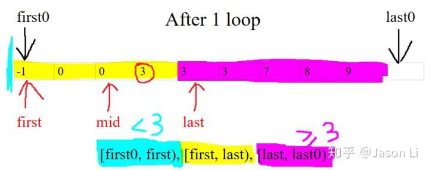
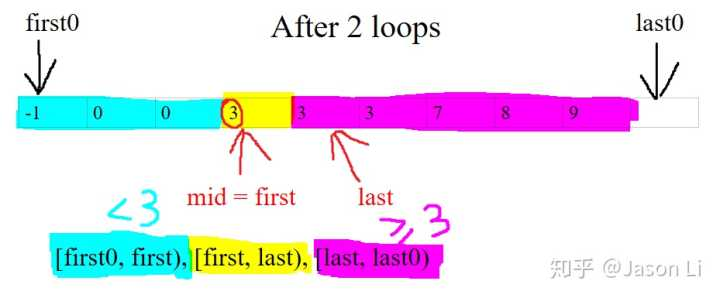
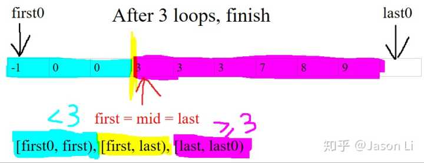

更新：一图解释二分法分类

强烈安利C++和Python标准库的超简洁、bug free的通用写法(C++: [lower\_bound](https://link.zhihu.com/?target=https%3A//en.cppreference.com/w/cpp/algorithm/lower**bound); 感谢评论区指认出Python标准库的[bisect\_left](https://link.zhihu.com/?target=https%3A//github.com/python/cpython/blob/3.9/Lib/bisect.py%23L50))

6行Python解决，同时适用于区间为空、答案不存在、有重复元素、搜索开/闭的上/下界等情况：

    def lower_bound(array, first, last, value):  # 求非降序范围[first, last)内第一个不小于value的值的位置
        while first < last: # 搜索区间[first, last)不为空
            mid = first + (last - first) // 2  # 防溢出
            if array[mid] < value: first = mid + 1 
            else: last = mid
        return first  # last也行，因为[first, last)为空的时候它们重合

`±1`的位置调整只出现了一次！而且最后返回`first`或`last`都是对的，无需纠结！v

诀窍是搜索区间`[first, last)`**左闭右开**！

好处都有啥？请下滑看看"Dijkstra的干货/题外话"ヽ(ﾟ▽ﾟ)ノ

（你一直在用的）两头闭区间`[l, r]`写出来的binary search一般免不了多写一两个`+1`,`-1`,`return`，而且区间为空时`l`和`r`只有一个是正确答案，极易出错，除非你有肌肉记忆。

  

如果你想求的不是`第一个不小于value的值的位置`，而是`任意等于value的值的位置`，你可以在更新`[first, last)`区间之前先检查`array[mid] == value`是否成立。以下我们只讨论广义的求上界、下界的二分搜索，适用于完全相等的值不存在的情况。

担心搞错范围 / 终止条件 / edge case ？

`array`不是升序怎么办？

且听我徐徐道来ヽ(ﾟ▽ﾟ)ノ

* * *

> 二分查找有几种写法？

一图即可解释，在`array`中搜索`value=3`：

Binary search找的无非是四个箭头中的一个：开/闭区间，上/下界。C++和Python标准库都只提供了找下界的函数，下标减一即可获得相邻互补的上界。如果只需找任意一个黄色value，可直接找闭区间下界（红箭头），然后再检查一次是否等于value；当然，也可以在二分法循环中检查。只讨论输入`array`是非降序non-descending order的情况。其他情况，如降序，可以通过自定义比较函数轻松转化为这种情况而无需修改原`array`。

一、搜索区间和中点
---------

i) 求**下界**，即找满足`x >= value`或`x > value`条件的**最小`x`**的位置，

用**左闭右开**搜索区间**`[first, last)`**，

区间为空时终止并返回`first`或`last`(重合，无需纠结)，

求中点时从**下界**`first`(闭区间侧)出发: `mid = first + (last - first) / 2`，

以确保区间长度为`1`时，`mid = first`仍在`[first, first + 1)`区间内；

  

ii) 求**上界**（找满足`x < value` 或 `x <= value`条件的最大`x`的位置），可以调用互补的求下界的函数再减一得到，如`x >= value`的下界再减一就是`x < value`的上界，所以`C++`标准库只提供求下界的两个函数。

如果非要写（不推荐），则是求下界的**镜面**情况，把所有数组下标反过来即可：

用**左开右闭**搜索区间`(first, last]`，

区间为空时终止并返回`last`或`first`(重合，无需纠结)，

求中点时从**上界**`last`(仍为闭区间侧)出发: `mid = last - (last - first) / 2`，

以确保区间长度为`1`时，`mid = last`仍在`(last - 1, last]`区间内。

  

**中点`mid`有了，怎样缩小区间才能不出错？**

**请往下看到"四、while loop的循环不变量"ヽ(ﾟ▽ﾟ)ノ有图有真相**

（**以下为详细解说，括号内的斜体为C++相关的选读(逃)**）

二、Dijkstra的干货/题外话
-----------------

为什么区间要写成左闭右开？怕傻傻分不清楚，一直用两头闭区间？

其实我们早就习惯了左闭右开区间，只不过你忘了它的便利。

例如：遍历长度为`n`的数组，下标`i`你是怎么写的？

你一定是使用左闭右开区间`[0, n)`作为起始和终止条件，这样一来循环执行次数为`n`，for loop结束时`i == n`，一目了然，且无需多余的`±1`边界调整：

    for (size**t i = 0; i < n; ++i) {
        // i is in [0, n)
    }

换成Python 3，区间则是`range(start, stop[, step])`，左闭(包括起点start)右开(不包括终点stop)：

    for i in range(n):
        # 等价于range(0, n)或range(0, n, 1)
        # i is in [0, n)

同理的还有[Python的slice](https://link.zhihu.com/?target=https%3A//docs.python.org/3/library/functions.html%23slice)，如list slicing:`arr[start:stop]`以及`arr[start:stop:step]`。

一切始于图灵奖得主[Dijkstra](https://link.zhihu.com/?target=https%3A//en.wikipedia.org/wiki/Edsger**W.**Dijkstra)（没错就是20分钟内不用纸笔发明[Dijkstra's Algorithm](https://link.zhihu.com/?target=https%3A//en.wikipedia.org/wiki/Dijkstra%2527s**algorithm)的那位神人）早在1982年的[安利](https://link.zhihu.com/?target=https%3A//www.cs.utexas.edu/users/EWD/transcriptions/EWD08xx/EWD831.html)(他还安利过[goto有害论](https://link.zhihu.com/?target=https%3A//en.wikipedia.org/wiki/Considered**harmful)，并且成功了)，大意是：

> 现在只有`a)`不会出现负数了。看来左闭右开的`a)`是唯一一种不反人类的写法！它还有一些个好处：  
> 1\. 区间两端值的差，如`[0, 4)`中的4 - 0 = 4，正好是区间或数组的长度  
> 2\. 刚好相邻的区间，如`[0, 2)`和`[2, 4)`， 中间值（即2）相同，一眼就可以看出来

综上，代码中使用`a)`的左闭右开区间既符合直觉，又可以省去代码中大量的`+1`和`-1`和edge case检查，减少[off-by-one error](https://link.zhihu.com/?target=https%3A//en.wikipedia.org/wiki/Off-by-one**error)，提高效率。

三、while loop第一行：如何取中点
---------------------

现在我们知道`lower**bound`在干啥，以及为啥区间要写成左闭右开了。

我们来看循环第一行，`mid = first + (last - first) // 2`，为何中点这么取？

    def lower**bound(array, first, last, value):
        while first < last: # 搜索区间[first, last)不为空
            mid = first + (last - first) // 2  # 防溢出
            if array[mid] < value: first = mid + 1
            else: last = mid
        return first  # last也行，因为此时重合

如

[@胖君](https://www.zhihu.com/people/78968074f6c057924268566991c84313)

等大佬们所言，

> 若用`mid = (first + last) / 2`算中点（下标的中位数），在C++、Java等语言里`(first + last)`可能会溢出。  
> 讽刺的是，这是多年以前的标准写法，且[问题存在了20年都没被发现](https://link.zhihu.com/?target=https%3A//ai.googleblog.com/2006/06/extra-extra-read-all-about-it-nearly.html)，比如Java标准库`java.util.Arrays`里的`binarySearch`，因为当年的硬件限制了数组长度，所以测试的时候没有溢出。  
> 解决方案就是我们的写法。评论区有人问为什么可以这么写，其实很简单：  
> `mid = (first + last) / 2`  
> `= (2 * first + last - first) / 2`  
> `= first + length / 2`，  
> 其中`length = last - first`为区间长度。  
> Python有big integer所以不怕溢出，但要记得Python 3 的整除是`//`。  
>
> 此外，中点的选择并不唯一：  
> 1\. 上位中位数：`upperMid = first + length / 2` （**不用`-1`，就它了**）  
> 2\. 下位中位数：`lowerMid = first + (length - 1) / 2`

不难发现只有`length`为偶数时它们才不同，分别是中间那一对下标中的更大和更小的，想想`[0, 3)`和`[0, 4)`就很好懂了。

由于这两个中位数都在区间`[first, last)`内，所以都可以采用。算上位中位数不用`-1`，就是你了！

**陷阱**: 当我们使用左开右闭区间`(first, last]`找上界时，闭区间在右侧！本文开头已经说明，算中点时应从闭区间一侧向中心靠拢：

`mid = last - (last - first) / 2`

以确保区间长度为1时，`mid = last`仍在`(last - 1, last]`区间内

如果不小心写成`mid = first + (last - first) / 2` 那么此时`mid = first`就超出`(first, last]`范围了，要么溢出要么死循环！

所以推荐用互补的求下界的函数，再减一得到上界。

四、while loop的循环不变量 - loop invariants
------------------------------------

（怎样缩小区间才不出错）（会写代码 vs 会用计算机科学的思考方式）

要真正理解这6行代码为啥能出正确答案，并每次写binary search都能bug free(而不是靠先写错再debug，或者死记硬背上/下界开/闭区间的四种情况，甚至其他答案说的区间长度小于一定值时暴力分类讨论)，首先需要理解`while`循环里的loop invariants (循环不变量)，**也就是代码跑到`while`里面时一定成立的条件（别怕，下面有图）**：

1.  搜索范围`[first, last)`不为空，即`first < last` ；
2.  搜索范围`[first, last)`左侧，即`[first0, first)`内所有元素(若存在)，都小于`value`，其中`first0`是`first`的初始值；
3.  搜索范围`[first, last)`右侧，即`[last, last0)`内所有元素(若存在)，都大于等于`value`，其中`last0`是`last`的初始值。

再看一遍代码：

    def lower_bound(array, first, last, value):
        while first < last: # 搜索区间[first, last)不为空
            mid = first + (last - first) // 2  # 防溢出
            if array[mid] < value: first = mid + 1
            else: last = mid
        return first  # last也行，因为此时重合

(图来啦)举个栗子，搜索整个`array = [-1, 0, 0, 3, 3, 3, 7, 8, 9]`，`value = 3`

初始状态，搜索区间两侧都为空，满足loop invariant 2和3

一开始黄色的搜索区间左右(青、紫)都是空的，loop invariants的2和3自然满足。

上图`array[mid] >= 3`，说明`mid`属于紫色！

在已知信息下，最大限度合理扩张紫色区间、缩小黄色搜索区间长度的操作是：

把`last`放到上图中`mid`的位置，即`last = mid` ：

紫色区间最大限度向左扩张了

如上图，新的`mid`满足`array[mid] < 3`，说明`mid`属于青色！在已知信息下，最大限度合理扩张青色区间、缩小黄色搜索区间长度的操作是：`first = mid + 1`：

此时搜索区间长度为1，只剩最后一步，答案要么是first要么是last

现在搜索区间长度缩短到1了！可以返回`first`了吗？不行，我们检查过了红圈左边和右边，却没有检查红圈本身。如果红圈是2，那么答案应该是上图的`last`才对。

之所以更新`first`或`last`的时候要最大限度缩小搜索区间（`first`更新为`mid + 1`而非弱一点的`mid`，`last`更新为`mid`而非弱一点的`mid + 1`），主要考虑并不是这个效率efficiency，而是上图区间长度为1的情况！此时`mid`就是`first`，`mid + 1`就是`last`，于是弱一点的更新等于没有更新，会导致死循环！

最后一步，上图中`array[mid] >= 3`，mid属于紫色，于是`last`左移一位，搜索结束：

最后区间`[first, last)`为空，青区间和紫区间都最大限度扩张了。所以，根据紫区间的定义`任意元素 >= 3`，已经饱和的它，第一个元素(若存在)的位置`last`就是答案！若没有满足要求`x >= 3`的元素，那么紫区间就是空的，停留在初始状态`[last0, last0)`，所以返回的是`last0`，即初始范围之后的第一个元素，表示“不存在”，无需特殊处理！

皆大欢喜的是，`first`与`last`重合，所以完全不需要纠结返回哪个！感谢Dijkstra！

五、C++中的相关函数
-----------

C++的`lower_bound()`搞明白了，那么`upper_bound()`和`equal_range()`又是怎么回事呢？

`upper_bound()` 和 `lower_bound()`一样是下界搜索，唯一不同的是第四行的`if`中的判断条件从：

`lower_bound()` 的 `array[mid] < value`，即小于，

变成了 `upper_bound()`的`!(value < array[mid])`，即`array[mid] <= value`，（用小于号判断小于等于关系：前面提到小于号是STL唯一的比较函数，且可以自定义）

所以`upper_bound()`返回的是第一个**大于**`value`的位置。

如此一来，`[first, last)`中与`value` 等价的元素的范围就是：

`[lower_bound(value), upper_bound(value))`

它们分别是这个区间的(左闭)下界和(右开)上界，因此得名。`equal_range(value)`的作用是同时返回这两个位置。

六、理解并使用C++<algorithm>和Python bisect的二分查找函数
---------------------------------------------

如何用`lower_bound/bisect_left`和`upper_bound/bisect_right`在`[first, last)`完成所有四种binary search (上/下界，开/闭区间)？

1.  `lower_bound(value)`本身找的是`x >= value`的下界，若为`last`则不存在；
2.  `upper_bound(value)`本身找的是`x > value`的下界，若为`last`则不存在；

因为区间是离散的，所以：

3\. `lower_bound(value) - 1` 即为`x < value`的上界，若为`first - 1`则不存在；

4\. `upper_bound(value) - 1` 即为`x <= value`的上界，若为`first - 1`则不存在。

