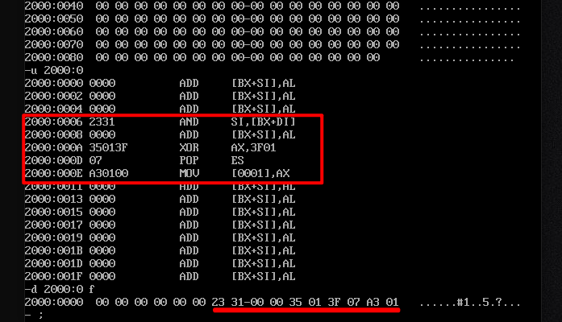

# C3-寄存器(内存访问)

## 实验任务3

```assembly
mov ax,2000
mov ss,ax
mov sp,10
mov ax,3123
...
```

分析：为什么`2000:0~2000:f`中的内容发生改变？(全零变成存储了某些**数据**)



中断机制。(单步中断？)

`T`指令调试时产生中断，为了保护原运行环境，把**标志寄存器**、`CS`、`IP`等入栈。