## 研究试验1 搭建一个精简的C语言开发环境

- 这里使用TC.EXE以及当前必要的依赖搭建这个精简的环境
  - C0S.OBJ
  - CS.LIB
  - EMU.LIB
  - GRAPHICS.LIB
  - MATHS.LIB


## 研究试验2 使用寄存器

2. 用Debug加载ur1.exe，用u命令查看ur1.exe编译后的机器码和汇编代码。
   思考：`main`函数的代码在什么段中？用Debug怎样找到ur1.exe中`main`函数的代码？
   回答：`main`函数的代码在CS段中，需要知道`main`函数的偏移地址才能找到`main`函数的代码。

3. 用下面的方法打印出ur1.exe被加载运行时，`main`函数在代码段中的偏移地址。

   ```c
   main ()
   {
   	printf("main:%x\n", main);
   }
   // main:1fa
   ```

   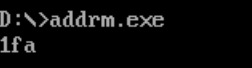

   思考：为什么这个程序能够打印出`main`函数在代码段中的偏移地址？

   > 函数名作为表达式，经历函数到指针隐式转换，变成指向函数的指针值，转换后的指针值即函数的入口地址。

4. 用Debug加载url.exe，根据上面打印出的`main`函数的偏移地址，用`u`命令察看`main`函数的汇编代码。仔细找到ur1.c中每条C语句对应的汇编代码。

```c
// PUSH BP
// MOV BP,SP
main(){
    _AX=1;						// mov ax,0001
    _BX=1;						// mov bx,0001
    _CX=2;						// mov cx,0002
    /**
     * mov ax,bx
     * add ax,cx
     */
    _AX=_BX+_CX;
    /**
     * mov ah,bl
     * add ah,cl
     */
    _AH=_BL+_CL;
    /**
     * mov al,bh
     * add al,cx
     */
    _AL=_BH+_CH;
    /**
     * pop bp
     * ret
     */
 }
```


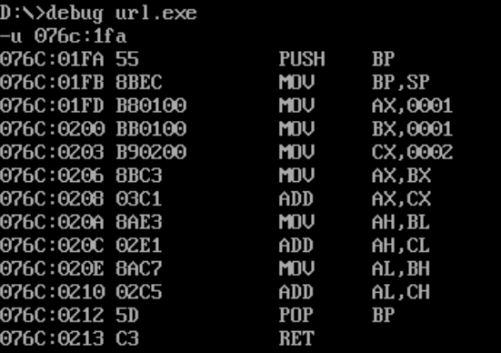

注意：在这里，对于`main`函数汇编代码开始处的`push bp mov bp,sp`和结尾处的`pop bp`，这里只了解到：这是C编译器安排的为函数中可能使用到bp寄存器而设置的，就可以了。

5. 通过`main`函数后面有`ret`指令，我们可以设想：C语言将函数实现为汇编语言中的子程序。研究下面程序的汇编代码，**验证**我们的设想。

```c
void f(void);
main() {
    _AX=1;
    _BX=1;
    _CX=2;
    f();
}
void f(void) {
    _AX=_BX+_CX;
}
```

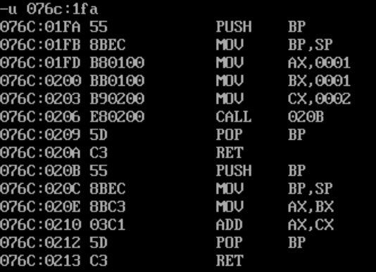


## 研究试验3 使用内存空间

1. 编一个程序um1.c：

```c
main() {
    *(char *)0x2000='a';					// mov byte ptr [2000],61
    *(int *)0x2000=0xf;						// mov word ptr [2000],000F
    
    /**
     * mov bx,2000
     * mov es,bx
     * mov bx,1000
     * ES:           	--?(段地址从es获取)
     * mov byte ptr [bx],61
     */
    *(char far *)0x20001000='a';

    _AX=0x2000;								// mov ax,2000H
    
    /**
     * mov bx,ax
     * mov byte ptr [bx],62
     */
    *(char *)_AX='b';

    _BX=0x1000;								// mov bx,1000H

    /**
     * add bx,bx
     * mov byte ptr [bx],61
     */
    *(char *)(_BX + _BX) = 'a';
    
    /**
     * mov bx,ax
     * mov al,[bx]		取ax地址的值存储在al，char--byte
     * xor cx,cx		将cx和CF置零，以存储高位加法结果(段地址)
     * add bx,1000
     * adc cx,2000		adc = cx + 2000 + CF(可能的进位)
     * mov es,cx
     * ES:           	--?(段地址从es获取)
     * mov [bx],al
     */
    *(char far *)(0x20001000 + _BX) = *(char *)_AX;
}
```


2. 编一个程序，用一条C语句实现在屏幕的中间显示一个绿色的字符`a`

```c
main() {
    *(int far *)0xB80007D0 = 0x261;
}
```


3. 分析下面程序中所有函数的汇编代码，思考相关问题。

```c
int a1,a2,a3;
void f(void);
main() {
    int b1,b2,b3;
    a1 = 0xa1;a2 = 0xa2;a3 = 0xa3;
    b1 = 0xb1;b2 = 0xb2;b3 = 0xb3;
}
void f(void) {
    int c1,c2,c3;
    a1 = 0xfa1;a2 = 0xfa2;a3 = 0xfa3;
    c1 = 0xfc1;c2 = 0xfc2;c3 = 0xfc3;
}
```

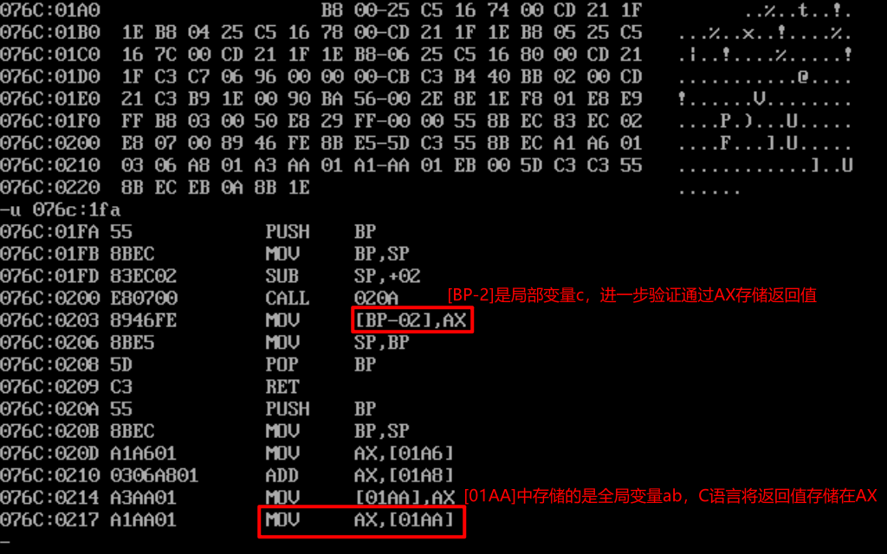

问题：C语言将全局变量存放在哪？将局部变量存放在哪？每个函数开头的`push bp `和`mov bp,sp`有何含义？

​	C语言将全局变量存放在内存区DS，将局部变量存放在栈。

1. 保护现场，以便还原
2. BP存储栈底，SP存储栈顶 (基于局部变量的数量改变SP)


4. 分析下面程序的汇编代码，思考相关的问题。

```c
int f(void);
int a,b,ab;
main() {
    int c;
    c=f();
}
int f(void) {
    ab = a+b;
    return ab;
}
```


问题：C语言将函数的返回值存放在哪里？

​			**存放在通用寄存器AX。**


5. 下面的程序向安全的内存空间写入从“a”到“h”8个字符，理解程序的含义，深入理解相关的知识。（注意：请自己学习、研究malloc函数的用法）

```c
#define Buffer ((char *) *(int far *)0x200)			// 0:200H
main() {
    Buffer = (char *)malloc(20);
    Buffer[10] = 0;
    while (Buffer[10]!=8) {
        Buffer[Buffer[10]] = 'a' + Buffer[10];
        Buffer[10]++;
    }
    free(Buffer);
}
```

debug以上代码的结果：

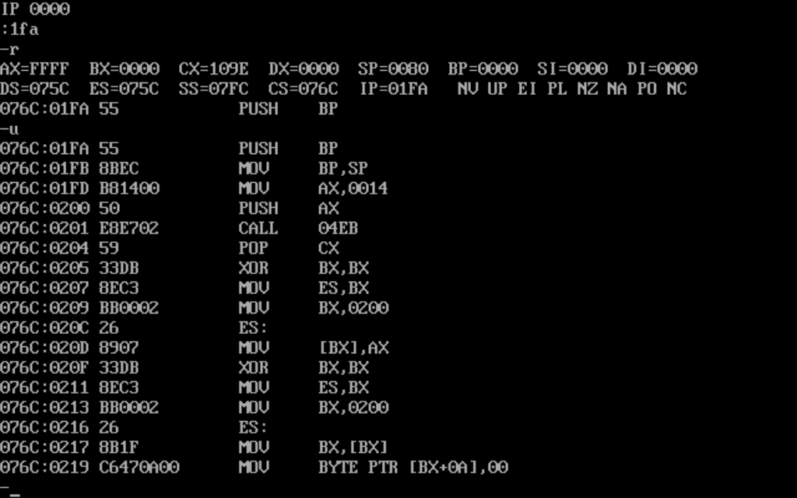

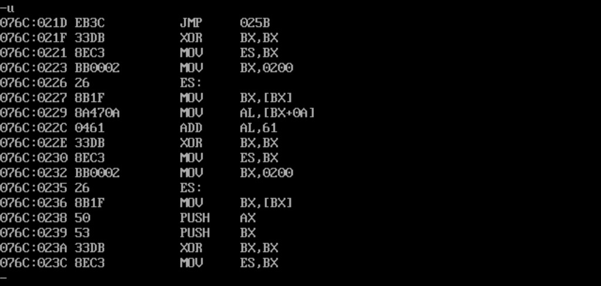

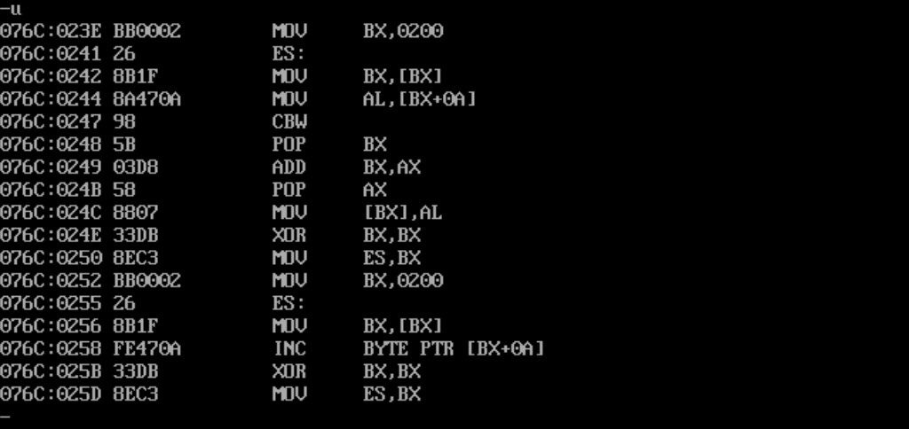

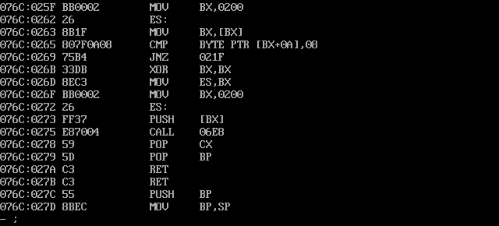

> - 这里malloc返回的值同样是经过AX来传递的
> - 值得注意的是，从代码可以看出，malloc获得的内存在DS段中，所以并不会随着程序返回而释放，所以需要调用free函数手动释放。当然整个程序退出后随着DS段被释放，这片内存就不会泄露了

- Buffer定义在`0:200H`，这是执行了`Buffer = (char *)malloc(20)`后的内存图

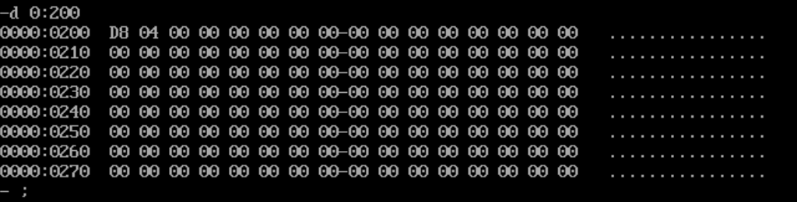

分析`Buffer = ((char *)*(int far *)0x200)`

从上一题我们得知，C语言将调用函数后的返回值存储在寄存器`AX`，那么我们就可以利用这个特性，在`call Address`之后用`p`调试，观察寄存器`AX`的值（若是，则会返回`malloc`申请的内存区的首地址），并用`d`察看该地址的数据分布（一般会有大于20Byte的全0），那么我们就可以猜测刚刚调用的就是`malloc()`.

如下图，将14H存储到`AX`寄存器，说明正在为调用`malloc`函数传参作准备：

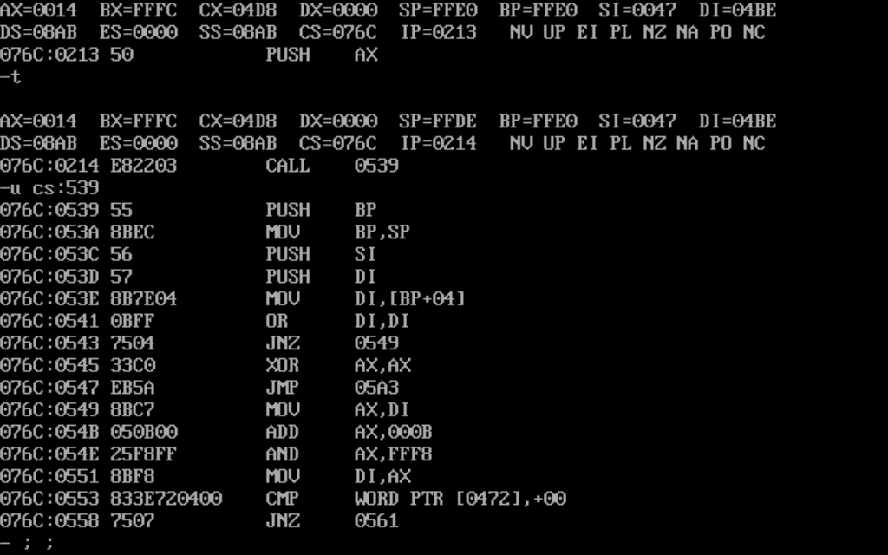

`malloc`实现的汇编语言，如下图：

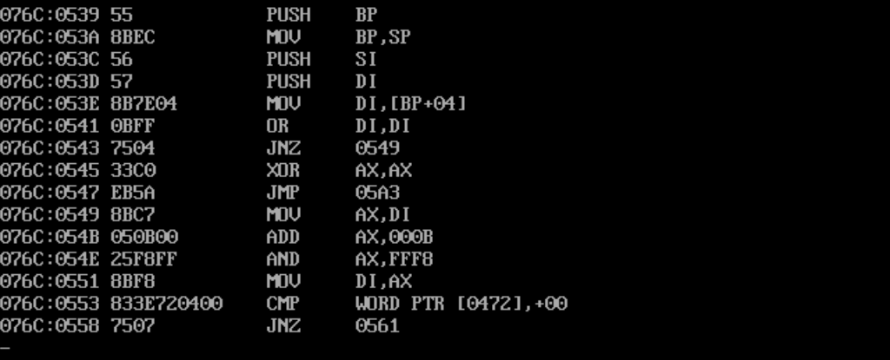

此语句执行，将需要创建的20Byte中的参数:`20=14H`，经由栈内存传参

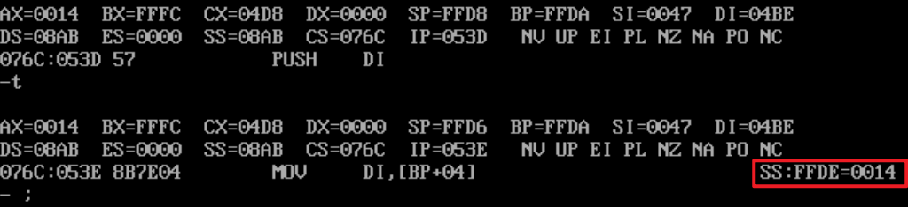

将参数传给寄存器`AX`

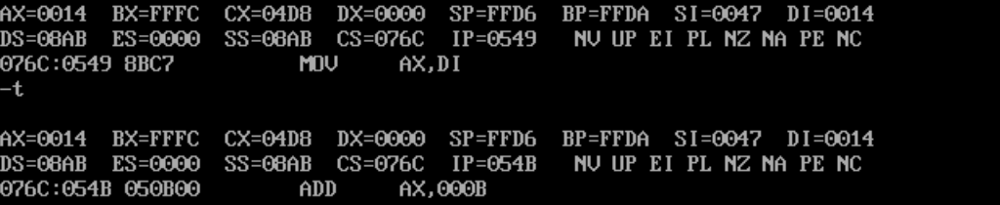

执行之后，将申请的内存区**(堆)**的地址存放在`AX`作为参数**(申请内存区的首地址)**返回：

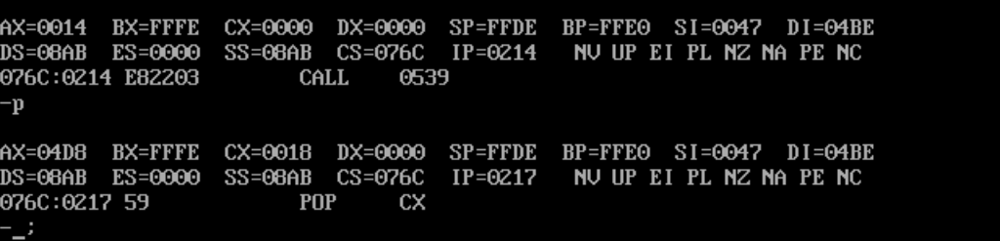

观察刚申请完的内存区的情况：

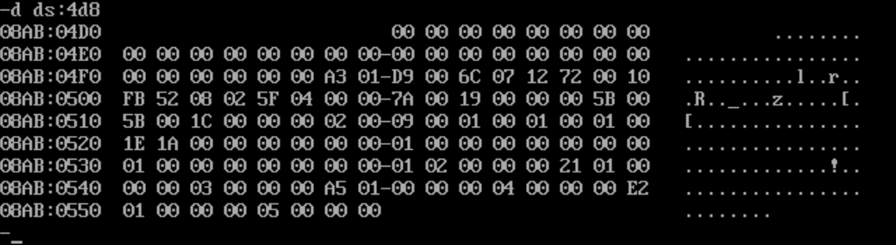


继续执行命令，发现此时将传回的参数**(申请内存区的首地址)**`AX=04D8`存储到`Buffer`所指向的地址是`ES:200`: 

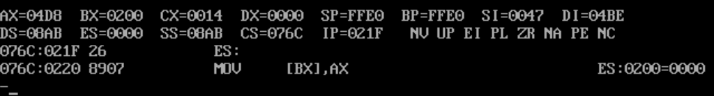

来到这里已经结束语句的分析。

这里则是继续取`ES:200H`所指向的地址，将`ES:[200H + AH]`的值置为0，对应于语句`Buffer[10]=0;`

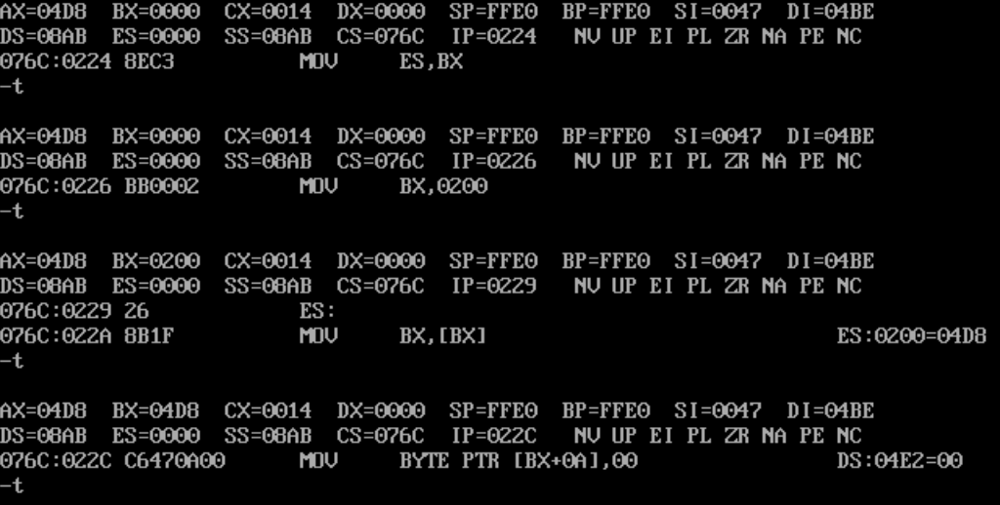

最后给申请的内存区赋值完后：（验证内存区）

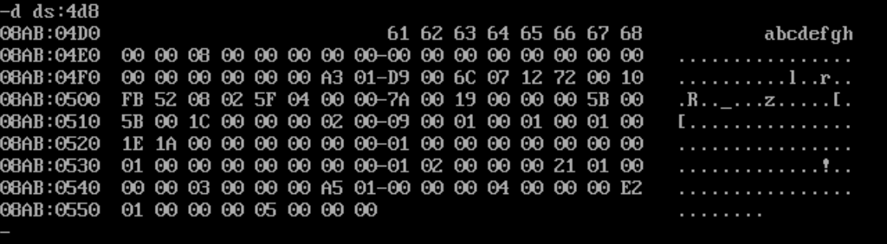


我们可以知道，尽管反汇编出来的汇编语句显得不那么“聪明”。如果由我们自己编写，类似上图的，会在把`AX`传回的首地址赋值到`ES:200H`之后，重新将寄存器`BX`置零，再从`ES:200H`取值(内存区首地址)的操作就能避免。我们会在把`AX`传回的首地址赋值到`ES:200H`之后，进而直接给`ES:200H+AH`赋值`0`，但是它们确实有效，因为这是翻译器模式化的翻译。

经过学习Nand2Tetris的虚拟机（原理相同，虚拟机将`vm`语言翻译成`Hack ASM`，以及C语言的编译器TC2.0将`C`翻译成`x86 ASM`），可以知道：我们编写的翻译器都是将被翻译语言的语法完整的解析到对应语言的语法，类似虚拟机中调用函数`call f n`，那么我们编写的翻译器就必须翻译成：保存现场，将（当前函数的参数，当前函数地址以及当前各内存段的指针，当前函数的局部变量…）压入栈，`goto` 某个地址，并为返回地址声明一个标签，为还原现场作准备。


调用`free`，释放内存：

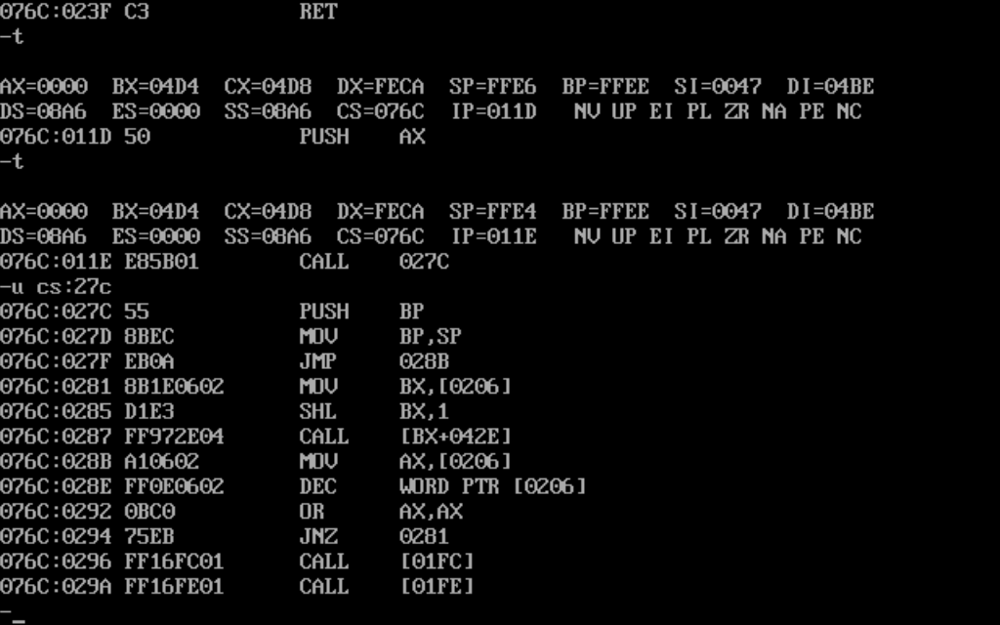


## 研究试验4 不用main函数编程

编一个程序`f.c`：

```c
f() {
    *(char far *) (0xb8000000 + 160*10 + 80) = 'a';
    *(char far *) (0xb8000000 + 160*10 + 81) = 2;
}
```

1. Question：
   ① 编译和链接哪个环节会出问题？
   ② 显示出的错误信息是什么？
   ③ 这个错误信息可能和哪个文件有关？

   Answer：
   ① 链接环节出现了错误
   ② “Linker Error:Undefined Symbol ‘Main’ in Module C0S”——在C0S模块中未定义的标号_main
   ③ 和C0S.OBJ这个文件有关

2. 用学习汇编语言时使用的LINK.EXE对TC.EXE生成的F.OBJ文件进行连接，生成F.EXE。用DEBUG加载F.EXE，察看整个程序的汇编代码。思考相关的问题。
   Question：
   ① F.EXE的程序代码总共有多少字节？
   ② F.EXE的程序能正确返回吗？
   ③ F函数的偏移地址是多少？
   Answer：
   ① 总共有1DH个字节（0~1CH）
   ② 可以执行，不能正确的返回
   ③ 0000h

   
   

写一个程序m.c

```c
main() {
    *(char far *) (0xb8000000 + 160*10 + 80) = 'a';
    *(char far *) (0xb8000000 + 160*10 + 81) = 2;
}
```

3. 用TC.EXE对M.C进行编译，连接，生成M.EXE，用Debug察看M.EXE整个程序的汇编代码。思考相关的问题。
   Question：
   ① M.EXE的程序代码总共有多少字节？
   ② M.EXE的程序能正确返回吗？
   ③ M.EXE程序中的main函数和F.EXE中的f函数的汇编代码有何不同？
   Answer：
   ① 
   ② 能正确返回
   ③ 没有不同
   
4. 用Debug对m.exe进行跟踪：（注意：使用g命令和p命令。）

   Question:
   
   ① 找到对main函数进行调用的指令的地址
   ② 找到整个程序返回的指令
   
   Answer：
   
   ① 
   
   **076C:011A**
   
   ② 
   
   **076C:0156**
   
5. 思考如下几个问题：
   ① 对main函数调用的指令和程序返回的指令是哪里来的？
   ② 没有main函数时，出现的错误信息里有和“C0S”相关的信息；而前面在搭建开发环境时，没有C0S.OBJ文件TC.EXE就无法对程序进行连接。是不是TC.EXE把C0S.OBJ和用户程序的.OBJ一起进行连接生成.EXE文件？
   ③ 对用户程序的main函数进行调用的指令和程序返回的指令是否就来自C0S.OBJ文件？
   ④ 我们如何看到C0S.OBJ文件中的程序代码呢？
   ⑤ C0S.OBJ文件里有我们设想的代码吗？

   Answer:

   ① C0S.OBJ
   ② 是的
   ③ 是的
   ④ 用LINK.EXE进行链接
   ⑤ 有

6. 用LINK.EXE对C:\MINIC目录下的C0S.OBJ进行连接，生成C0S.EXE。
   用Debug分别察看C0S.EXE和M.EXE的汇编代码。注意：从头开始察看，两个文件中的程序代码有和相同之处？

   两个程序的代码基本相同，且都是在011A调用了CALL指令，在0156调用了INT 21中断

7. 用Debug找到M.EXE中调用main函数的CALL指令的偏移地址，从这个偏移地址开始向后察看10条指令；然后用Debug加载C0S.EXE，从相同的偏移地址开始向后察看10条指令，对两处的指令进行对比。

M.EXE的汇编代码:

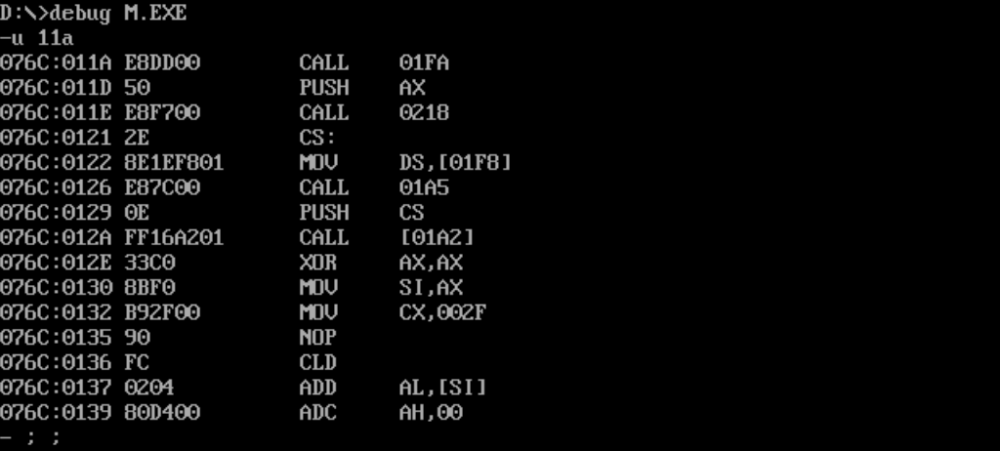

C0S.EXE的汇编代码：

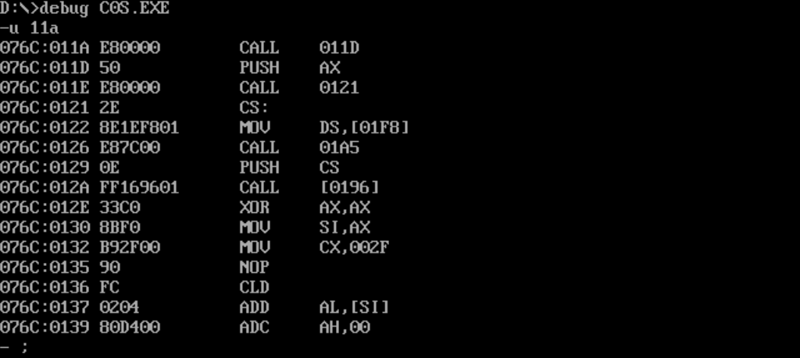

M.EXE和C0S.EXE在偏移地址011A之后的10条指令除了跳转指令的跳转地址有所不同外几乎完全相同。

8. 下面，我们用汇编语言编一个程序C0S.ASM，然后把它编译为C0S.OBJ，替代C:\MINIC目录下的C0S.OBJ。

程序C0S.ASM：

```assembly
assume cs:code
data segment
    db 128 dup (0)
data ends

code segment
start:
    mov dx,data
    mov ds,ax
    mov ss,ax
    mov sp,128

    call s

    mov ax,4C00H
    int 21H

s:
code ends
end start
```

9. 在C:\MINIC目录下，用TC.EXE将F.C重新进行编译，连接，生成F.EXE。这次能通过连接吗？F.EXE可以正确运行吗？用Debug察看F.EXE的汇编代码。
   ① 能通过连接

   ② 可以正确运行

   ③ 汇编代码如下：

   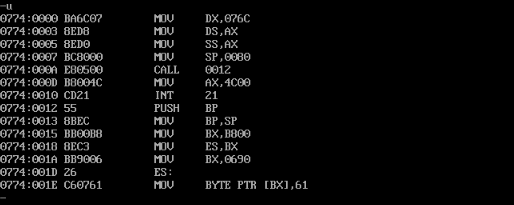

10. 在新的C0S.OBJ的基础上，写一个新的F.C，向安全的内存空间写入从“a”到“h”的8个字符，分析、理解F.C。
    程序F.C：

```c
#define Buffer ((char *)*(int far *)0x200)

f(){
	Buffer = 0;
	Buffer[10] = 0;
	while(Buffer[10]!=8){
		Buffer[Buffer[10]]='a'+Buffer[10];
		Buffer[10]++;
	}
}
```

汇编代码如下：

```assembly
MOV AX,076A
MOV DS,AX
MOV SS,AX
MOV SP,0080
CALL 0012 ; 调用程序中的第一个函数
MOV AX,4C00
INT 21

; 0012: 进入f()函数，保存栈底，更新栈顶，相当于分离原程序环境和被调用程序环境的栈内存
PUSH BP 
MOV BP,SP

; Buffer = 0;
XOR BX,BX
MOV ES,BX
MOV BX,0200
ES:
MOV WORD PTR [BX],0000 ; 将0:200H处的内存单元改为0

; Buffer[10] = 0;
XOR BX,BX
MOV ES,BX
MOV BX,0200
ES:
MOV BX,[BX] ; 将0:200H处的内存字单元存入BX中，将该值作为偏移的基址
; 证明在汇编中，访问数组元素 与 访问malloc申请内存单元 的方式类似。
; 访问数组元素和访问malloc申请内存单元，DS:[BX+index]
; 区别:数组的偏移基址为0(直接将Symbol作为偏移基址)，而malloc是获取程序向系统申请的内存因而偏移基址由系统决定(研究试验3.5是4d8)
MOV BYTE PTR [BX+0A],00 ; 将DS:AH处的内存单元改为0
JMP 006D ; 跳转到while的循环条件判断

; Buffer[Buffer[10]]='a'+Buffer[10];
XOR BX,BX
MOV ES,BX
MOV BX,0200
ES:
MOV BX,[BX] ; BX=[0:200H]，将该值作为偏移的基址
MOV AL,[BX+0A] ; AL等于Buffer[10]，即将DS:AH内存字节单元的内容存入AL中
ADD AL,61 ;为AL加上'a'

XOR BX,BX
MOV ES,BX
MOV BX,0200
ES:
MOV BX,[BX]  ; BX=[0:200H]，将该值作为偏移的基址
PUSH AX  ; AX='a'+Buffer[10].在第一次循环中是61H,第二次61H+1...
PUSH BX  ; BX=[0:200H]

XOR BX,BX
MOV ES,BX
MOV BX,0200
ES:
MOV BX,[BX] ; BX=[0:200H]，将该值作为偏移的基址
MOV AL,[BX+0A] ; 将Buffer[10]的值传入AL，即将DS:AH处的内存字节单元存入AL中
CBW ; 将AL扩展至16位
POP BX ; 取回BX=[0:200H]
ADD BX,AX ; BX: Buffer[Buffer[10]] = Buffer[10]+[0:200H]
POP AX ; 取回AX='a'+Buffer[10]
MOV [BX],AL ; 将所要设置的数值'a'+Buffer[10]存入Buffer[Buffer[10]]中

; Buffer[10]++;
XOR BX,BX
MOV ES,BX
MOV BX,0200
ES:
MOV BX,[BX] ; BX=[0:200H]
INC BYTE PTR [BX+0A] ; Buffer[10]++

; 006D，跳转此处进行while判断
XOR BX,BX
MOV ES,BX
MOV BX,0200
ES:
MOV BX,[BX]
CMP BYTE PTR [BX+0A],08 ; while判断: Buffer[10]是否等于8
JNZ 0031 ; 不等于则继续进入循环体
; 等于则还原环境(恢复栈顶)，并返回调用f()后的下一条语句
POP BP 
RET
```


## 研究试验5 函数如何接受不定数量的参数

1. 写一个程序`a.c`：

```c
void showchar(char a,int b);
main() {
    showchar('a', 2);
}
void showchar(char a, int b) {
    *(char far *)(0xb8000000 + 160*10+80) = a;
    *(char far *)(0xb8000000 + 160*10+81) = 2;
}
```

- `main`函数通过栈`push/pop`传递参数给`showchar`，参数**自右向左**入栈

- `showchar`通过栈接收参数，但是不进行弹出，而是直接通过BP读取SS段中的内容，如：`mov al,[BP+4]`

  不弹出应该是为了保护还原现场，当传入的是变量而不是值时，需要还原变量的值，此时想起了`swap`…

- 因为在参数入栈之后还进行了`IP`和`BP`的入栈操作
  所以取参数`char a`时，加上`idata 4`，取参数`int b`时，加上`idata 6`


2. 写一个程序`b.c`：

```c
void showchar(int,int,...);
main() {
    showchar(8,2,'a','b','c','d','e','f','g','h');
}
void showchar(int n, int color, ...) {
    int a;
    for(a=0; a!=n; a++) {
        *(char far *)(0xb8000000 + 160*10+80+a+a) = *(int *)(_BP+8+a+a);
        *(char far *)(0xb8000000 + 160*10+81+a+a) = color;
    }
}
```

- `showchar`通过参数`int n`传递需要显示多少个字符，而参数`n`在最后入栈，`SS:[BP+4]`即可获得

  `+4`是因为`call`之后需要`push bp`

- 参数**自右向左**入栈，最后入栈的参数是指向`format`首地址(偏移地址)的指针，而`printf`函数会`cmp si,[bp+4]`和`jnz 235`，当`cmp`和`jnz`同时运算，效果等同于`jne`，即进行判断`si`是否等于`[bp+4]`的值，`si`作为counter

- 所以说`printf`的变参要和`format`中的占位符一一对应，否则会出现难以理解的输出。


3. 实现一个简单的`printf`函数，只需支持`%c %d`即可

   实现char和int


```c
 MyPrintf(char * format,...);

 main(){
     MyPrintf("This is MyPrintf %c %d",'!',233);
 }

 MyPrintf(char * format,...){
     int cnt=0;
     int offset=0;
     while(*format!=0){
         switch (*format)
         {
         case '%':
             format+=1;
             if(*format=='c'){
                 *(char far *)(0xb8000000+160*12+40+2*offset++)=*(int *)(_BP+6+2*cnt++);
             }else if(*format=='d'){
                 int num=*(int *)(_BP+6+2*cnt++);
                 int len=0;
                 char tmp[10];
                 while (num!=0){
                     tmp[len++]=(num%10)+0x30;
                     num/=10;
                 }
                 len--;
                 while (len>=0){
                     *(char far *)(0xb8000000+160*12+40+2*offset++)=tmp[len--];
                 }
             }else{
                 *(char far *)(0xb8000000+160*12+40+2*offset++)=*format;
             }
             format+=1;
             break;
         default :
             *(char far *)(0xb8000000+160*12+40+2*offset++)=*format;
             format+=1;
             break;
         }
     }
 }
```
