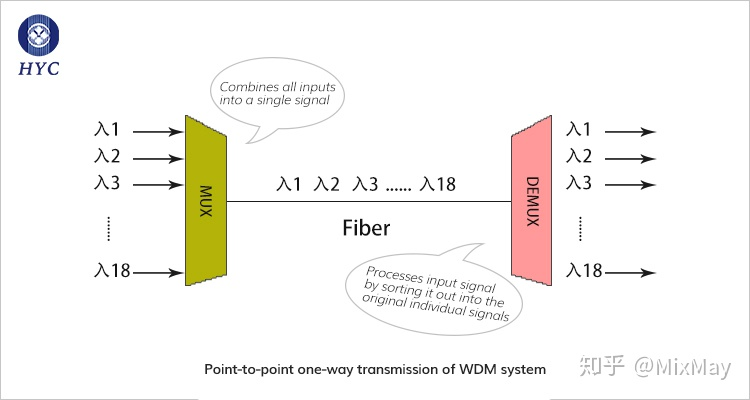

# [布尔逻辑 Boolean Logic]

**And/Or/Not算子都可以只用Nand或Nor函数来构建（可以单纯用Nand也可以单纯用Nor）**

`Nand`: 只有1-1为0，其他情况(0-0, 0-1, 1-0)均为1（Not And）

`Nor`:   只有0-0为1，其他情况(0-1, 1-0, 1-1)均为0（Not Or）

eg: `x Or y` = `(x Nand x) Nand (y Nand y)`

Or 和 And:

| Function                     | x     | 0           0           1           1     |
| ---------------------------- | ----- | ----------------------------------------- |
| —————                        | **y** | **0           1           0           1** |
| `(x Nand x) Nand (y Nand y)` | Or    | 1           1           1           0     |
| `(x Nand y) Nand (x Nand y)` | And   | 0           0           0           1     |

 Not:

| Function     | x    | 0           1 |
| ------------ | ---- | ------------- |
| `(x Nand x)` | Not  | 1           0 |


**既然每个布尔函数(P10)都能通过规范表示法由And、Or和Not构成，那么每个布尔函数也能仅使用Nand函数来构成**

Nand -> (And、Or和Not) -> (任意的布尔函数)：一生三，三生万物。

实际意义：一旦在物理上实现了Nand、功能，就可以使用很多这样的物理设备，通过 特定的连接方式（Function）来构建任何布尔函数的硬件实现。

**求解formula的方法：**

1. Boolean Expression.布尔表达式

2. Truth Table.真值表

   构造出满足取值为`1`的布尔表达式，通过`OR`连接所有的表达式


### [HDL实现基本门]

HDL: Hardware Description Language.

**Not:** 

| Function        | x    | 0           1 |
| --------------- | ---- | ------------- |
| `(x Nand true)` | Not  | 1           0 |

**Or / And / Xor:** 

| Function                                  | x      | 0           0           1           1     |
| ----------------------------------------- | ------ | ----------------------------------------- |
| —————                                     | **y**  | **0           1           0           1** |
| `(x Nand true) Nand (y Nand true)`        | Or     | 1           1           1           0     |
| `(x Nand y) Nand true`                    | And    | 0           0           0           1     |
| **—————————————————————–**                | **—–** | **———————————**                           |
| `And( Nand(Not(x), Not(y)), Nand(x, y) )` | Xor    | 0           1           1           0     |
| `Nand(Not(x), Not(y)`                     | —–     | exclude 0-0: (0-0)=>0                     |
| `Nand(x, y)`                              | —–     | exclude 1-1: (1-1)=>0                     |


### [逻辑门]

**Multiplexor:** （多路复用，**多路输入**根据**选择位**进行选择性**单路输出**）

| Function                             | x           | 0           0           1           1     |
| ------------------------------------ | ----------- | ----------------------------------------- |
| —————                                | **y**       | **0           1           0           1** |
| —————                                | **sel**     | **0           1**                         |
| `Or(And(x, Not(sel)), And(b, sel) )` | Multiplexor | 8种可能[ 4 * (2-sel) ]                    |
| `Not(sel)`                           | —————-      | 控制x, y运算结果不相同                    |
| `And(x, Not(sel))`                   | —————-      | 控制sel = 0时输出x, 且只有1-1时out = 1    |
| `And(y, sel)`                        | —————-      | 控制sel = 1时输出y, 且只有1-1时out = 1    |


**Demultiplexor:** （解复用，将**单路输入**根据**选择位**划分为**多路输出**）

| Function                          | in            | 0           0           1           1 |
| --------------------------------- | ------------- | ------------------------------------- |
| —————                             | **sel**       | **0           1**                     |
| `And(in, Not(sel)), And(in, sel)` | Demultiplexor | 4种可能                               |

4种可能: 

| in   | set  | a    | b    |
| ---- | ---- | ---- | ---- |
| 0    | 0    | 0    | 0    |
| 0    | 1    | 0    | 0    |
| 1    | 0    | 1    | 0    |
| 1    | 1    | 0    | 1    |


### [多位逻辑门]

**Mux16:** 

```haxe
Mux(a=a[1], b=b[1], sel=sel, out=out[1]); 
…… 
Mux(a=a[15], b=b[15], sel=sel, out=out[15]);
```


### [多位多通道逻辑门]

`m`个`n`位输入变量中选择一个并从其中单一的`n`位输出到 总线输出 上。

k个控制位指定选择，`k = log₂m`

**Mux4way16:** （选择输入以输出）

`m = 4, n = 16, k = 2`

```haxe
IN a[16], b[16], c[16], d[16], sel[2];
OUT out[16];

PARTS:
Mux16(a=a, b=b, sel=sel[0], out=e);
Mux16(a=c, b=d, sel=sel[0], out=f);
Mux16(a=e, b=f, sel=sel[1], out=out);
```


**Mux8way16:** 

```haxe
IN a[16], b[16], c[16], d[16],
   e[16], f[16], g[16], h[16],
   sel[3];
OUT out[16];

PARTS:
// array cells [0..n]
Mux4Way16(a=a, b=b, c=c, d=d, sel=sel[0..1], out=x1);
Mux4Way16(a=e, b=f, c=g, d=h, sel=sel[0..1], out=x2);
Mux16(a=x1, b=x2, sel=sel[2], out=out);
```


**DMux4Way**：（选择通道以输出）

```haxe
IN in, sel[2];
OUT a, b, c, d;

PART:
Not(in=sel[0], out=sel00);
Not(in=sel[1], out=sel10);

And(a=in, b=sel10, out=a1);
And(a=a1, b=sel00, out=a);

And(a=in, b=sel10, out=b1);
And(a=b1, b=sel[0], out=b);

And(a=in, b=sel[1], out=c1);
And(a=c1, b=sel00, out=c);

And(a=in, b=sel[0], out=d1);
And(a=d1, b=sel[1], out=d);
```


**DMux8Way:** 

```haxe
IN in, sel[3];
OUT a, b, c, d, e, f, g, h;

PARTS:
DMux4Way(in = in, sel = sel[1..2], a = o1, b = o2, c = o3, d = o4);
DMux(in = o1, sel = sel[0], a = a, b = b);
DMux(in = o2, sel = sel[0], a = c, b = d);
DMux(in = o3, sel = sel[0], a = e, b = f);
DMux(in = o4, sel = sel[0], a = g, b = h);
```


DMux和Mux的区别：

