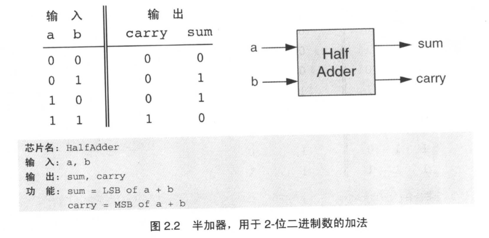
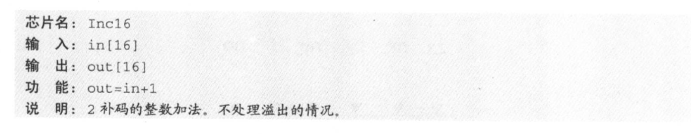
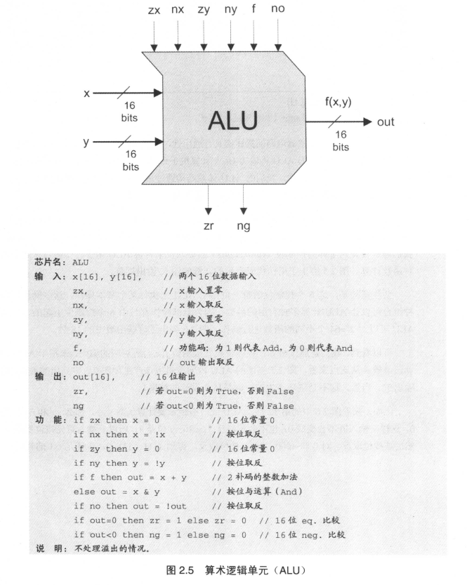

# [布尔算法运算 Boolean Arithmetic]

### [背景知识]

两个`n-`位数字二进制加法的计算机硬件可以由三位加法的逻辑门构建而成。（两个计算位加上一个进位）

**在4-位二进制系统中的有符号数的2-补码表示**

| 正数     | 负数        |
| -------- | ----------- |
| 0 – 0000 |             |
| 1 – 0001 | 1111 – (-1) |
| 2 – 0010 | 1110 – (-2) |
| 3 – 0011 | 1101 – (-3) |
| 4 – 0100 | 1100 – (-4) |
| 5 – 0101 | 1011 – (-5) |
| 6 – 0110 | 1010 – (-6) |
| 7 – 0111 | 1001 – (-7) |
|          | 1000 – (-8) |

计算`-x`原理：
$$
2^n-x = 1 + (2^n-1)-x
$$
由此可知，用补码表示`n-`位二进制系统有如下属性：

- 系统能对所有**2^n^**个有符号数进行编码，最大的数(0111)和最小的数(1000)分别为**(2^n-1^-1)**和**(-2^n-1^)**.
- 所有正整数的编码的首位是0.
- 所有负整数的编码的首位是1.
- *为了通过`x`的编码获得`-x`的编码，所有最右边的0和从左边起的第一个1保持不变，然后将剩余的位取反。*等价的捷径就是，**对`x`的所有的位取反，然后加上1，这个方案更容易在硬件中实现.**

这种表示法有个特别吸引人的特征：**任何两个用补码表示的有符号数的加法和与正数的加法完全相同**。

eg: 

1.加法(-2) + (-3)

使用补码(`4-`位)表示：(1110)₂ + (1101)₂  = (1011)₂  ，(丢掉溢出位)

正好是-5的补码.

**我们不用去关心这些代码表示的数字（正数还是负数）**

2.减法可以看成`x - y = x + (-y)`，补码表示中，计算`-y`：所有位取反再加1

**以上意味着能用单一芯片（成为算术逻辑单元ALU，ALU即`Arithmetic Logical Unit`）将硬件执行的所有基本算术操作和逻辑操作封装起来**.

### [规范详述]

1. 加法器(Adders)
   - **半加器**(Half-Adders)
   - **全加器**(Full-Adders)
   - **加法器**(Adders)

- **半加器**(Half-Adders)：用来进行`2-`位二进制数的加法.

- **全加器**(Full-Adders)：用来进行`3-`位二进制数加法.  

- **加法器**(Adders)：用来进行两个`n-`位加法.(图为16位)

- **增量器**(incrementer)：用来对指定的数字加1.

### 算术逻辑单元(ALU)

Hack的ALU计算一组固定的函数`out = f(x, y)`，这里`x`和`y`是芯片的两个`16-`位输入，`out`是芯片的`16-`位输出，该函数表由18个固定函数组成，通过设置六个称为控制位(control bits)的输入位来告诉ALU用哪一个函数来进行何种函数计算。

ALU可以对2^6^=64个不同的函数进行操作。