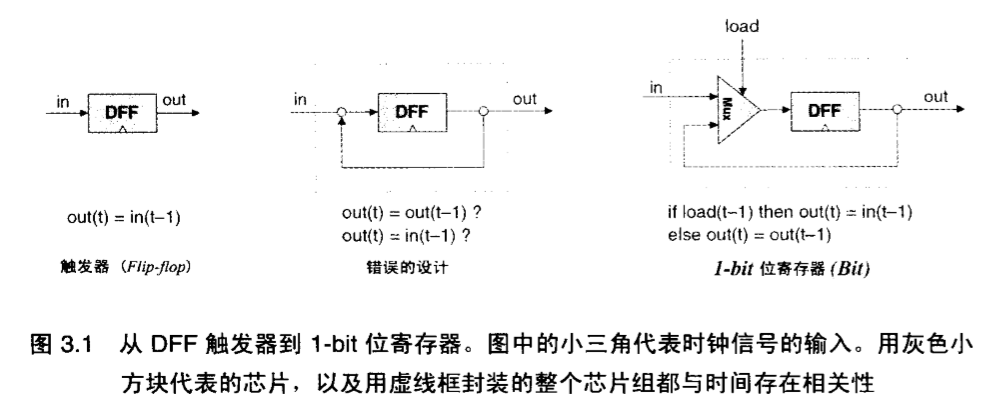
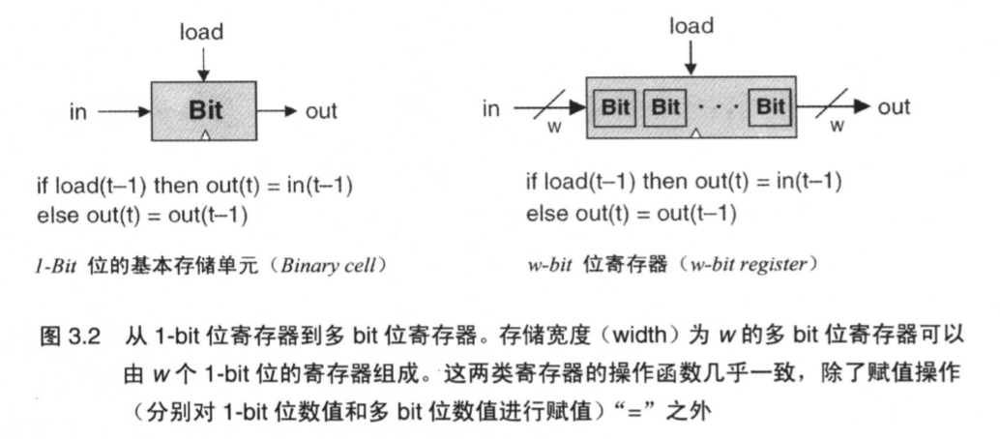
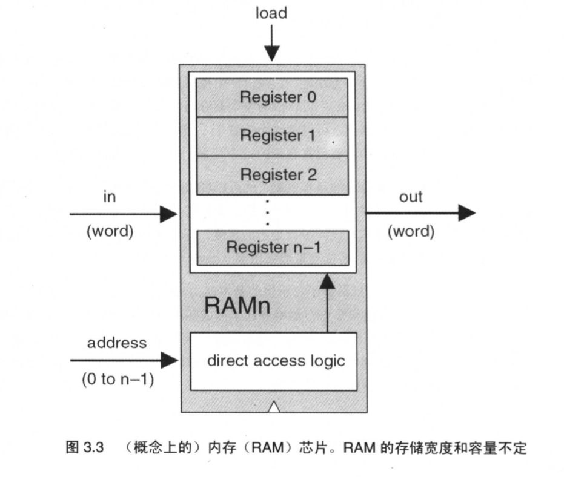
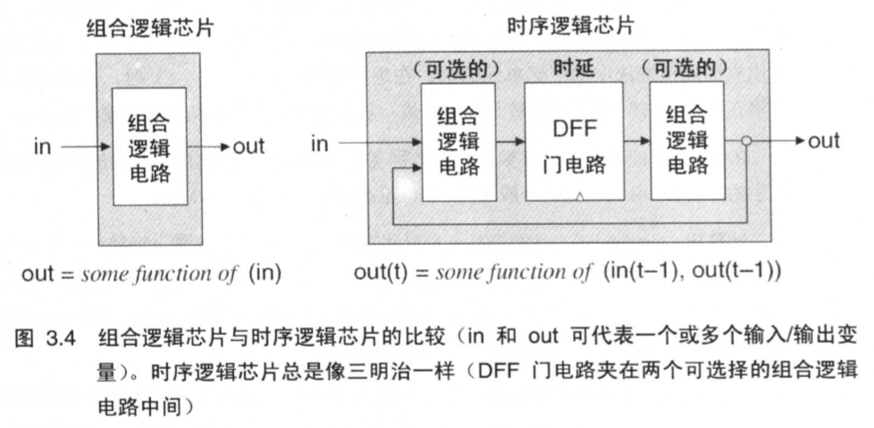
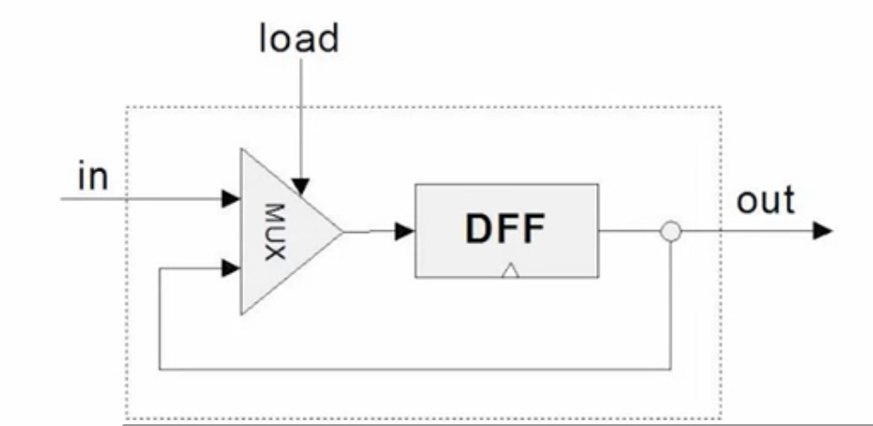
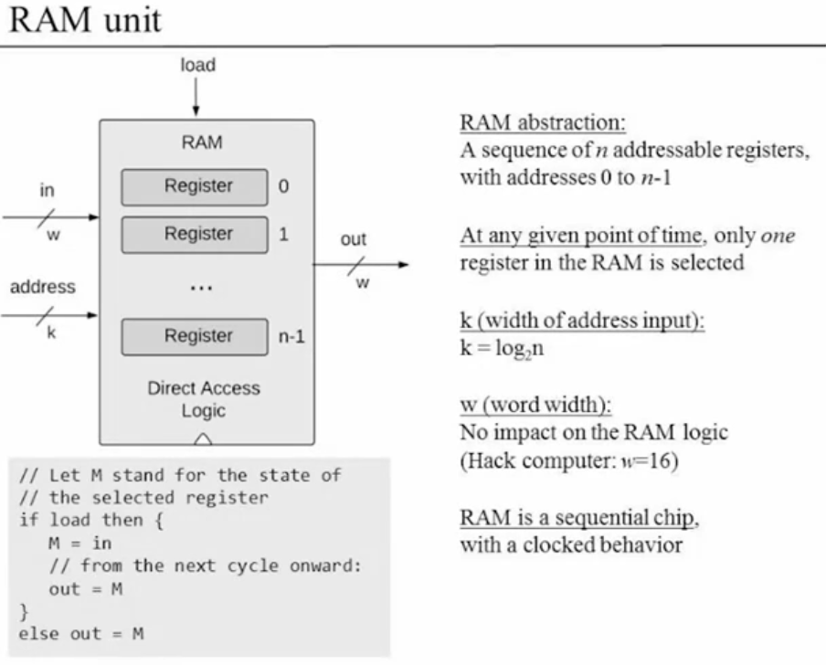
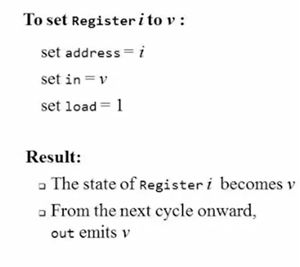
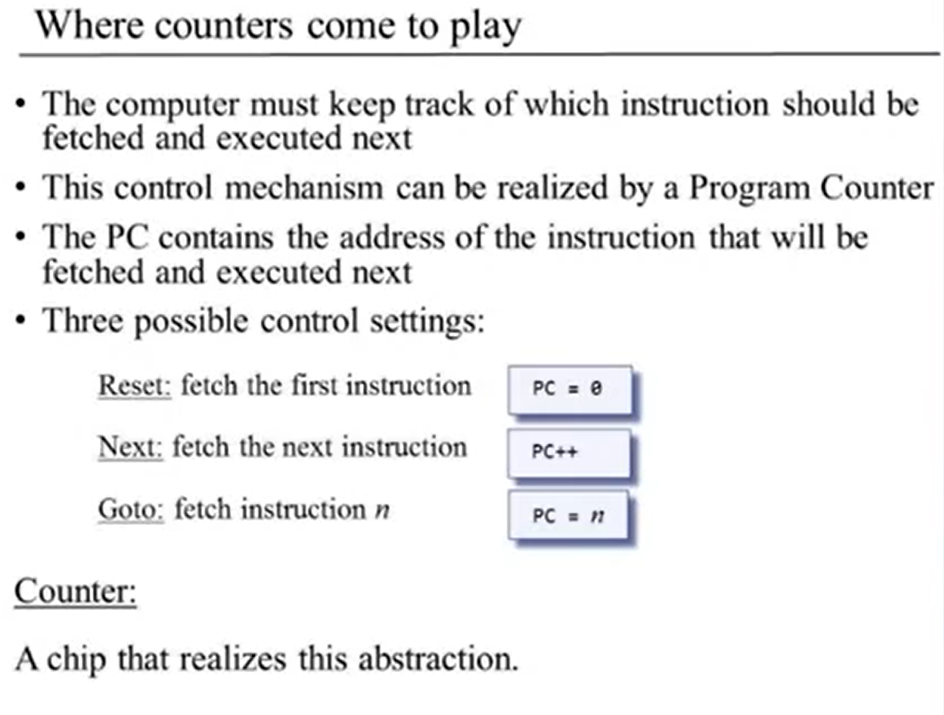

# [时序逻辑]

### [背景知识]

**时钟(Clock)**: 计算机里时间的流逝是用主时针(master clock)来表示的，它提供连续的**交变信号序列**。硬件实现通常基于**振荡器(oscillator)**，其在两个信号值**0-1**，或称**“低电平-高电平(low-high, tick-tock)”**之间交替变化。两个相邻的上升沿之间的时间间隙称为时钟的**周期(cycle)**，每个时钟周期模塑一个**离散的时间单元**。通过硬件电路，这个信号同时被传送到计算机平台的每个时序芯片中。


**触发器(Flip-Flops)**: 本书使用**数据触发器(Data Flip-Flop, DFF或称D触发器)**。实现基于时间的行为：
$$
out(t) = in(t - 1)
$$
t是当前时钟周期。换而言之，DFF能够简单的实现将前一个时间周期的输入值作为当前周期的输出值。

`out(t) = in(t - 1)`是所有计算机硬件维持自身状态的基础，二进制单元 -> 寄存器 -> 任意大的随机存取记忆单元(RAM) 都是如此.


**寄存器(Registers)**: 能够“储存”某一时刻的值，实现经典的存储行为：
$$
out(t) = out(t - 1)
$$
从另一个方面来说，DFF仅能够输出它前一时钟周期的输出，也就是`out(t) = in(t - 1)`。这提示了我们，可以通过DFF来实现寄存器，只需将后面的输出反馈到它的输入就可以了。



如此一来，在任何时刻`t`，这个设备的输出都会重现它在时刻`t-1`的值。

如图3.1右，

```html
load = 1, out(t) = in(t-1),  相当于wirte操作, 希望开始存储新值, 把值置于in输入口;
load = 0, out(t) = out(t-1), 相当于read操作, 希望一直存储它的内部值直到新的指令到来
```




**内存(Memories)**: …… 随机存取内存(RAM, Random Acess Memory): 在RAM上能够随机访问被选择的字而不会受限于访问顺序。



**计数器(Counter)**: 每经过一个时间周期计数器就增加1个单位，执行函数`out(t) = out(t-1) + c`，这里`c`就是1.


### [时间问题]

至此本章介绍的芯片都是时序芯片(sequential chip)。简单来说，时序芯片就是直接或间接地嵌入一个或多个DFF门的芯片。

反馈回路：输出依赖于输入，而输入本身有依赖于输出，因此输出只依赖自身。



……………………….


### [规范详述]

- D触发器(DFFs)

- 寄存器 (基于DFFs)

- 存储块 (基于寄存器)

- 计数器芯片 (基于寄存器)

 

### [实现硬件]

**1Bit寄存器**：

- If load[t] == 1 then out[t+1] = in[t]
  - else out does not change (out[t+1] = out[t])



```haxe
CHIP Bit {
    IN in, load;
    OUT out;

    PARTS:
    // lastOut is equal to the last time out, Assigned by DFF's lastOut
    Mux(a=lastOut, b=in, sel=load, out=muxOut);
    // cause the out is distinct(Only use once), so we can add out to copy the out
    DFF(in=muxOut, out=lastOut, out=out);
}
```


**n-Bits寄存器**：

n个**1Bit寄存器**串联。


**n-Bits RAM(Random Access Memory)**：



address用于寻址：根据`address = i`找出需要载入的**1Bit寄存器**，此时该寄存器设置`load = 1，in = M`，并在下一个时间周期`out = M`，实现`out(t) = in(t-1)`



```haxe
// 16-bit register:
CHIP Register {
    IN in[16], load;
    OUT out[16];

    PARTS:
    // No Mux16, because DFF only accept 1 bit input & output.
    Bit(in=in[0], load=load, out=out[0]);
    Bit(in=in[1], load=load, out=out[1]);
    Bit(in=in[2], load=load, out=out[2]);
    Bit(in=in[3], load=load, out=out[3]);
    Bit(in=in[4], load=load, out=out[4]);
    Bit(in=in[5], load=load, out=out[5]);
    Bit(in=in[6], load=load, out=out[6]);
    Bit(in=in[7], load=load, out=out[7]);
    Bit(in=in[8], load=load, out=out[8]);
    Bit(in=in[9], load=load, out=out[9]);
    Bit(in=in[10], load=load, out=out[10]);
    Bit(in=in[11], load=load, out=out[11]);
    Bit(in=in[12], load=load, out=out[12]);
    Bit(in=in[13], load=load, out=out[13]);
    Bit(in=in[14], load=load, out=out[14]);
    Bit(in=in[15], load=load, out=out[15]);
}
```


**Memory of 8 registers, each 16 bit-wide.**

```haxe
CHIP RAM8 {
    IN in[16], load, address[3];
    OUT out[16];

    PARTS:
    // in accordance with address, locate which register to load
    DMux8Way(in=in, sel=address, a=in0, b=in1, c=in2, d=in3, e=in4, f=in5, g=in6, h=in7);

    Register(in=in0, load=load, out=out0);
    Register(in=in1, load=load, out=out1);
    Register(in=in2, load=load, out=out2);
    Register(in=in3, load=load, out=out3);
    Register(in=in4, load=load, out=out4);
    Register(in=in5, load=load, out=out5);
    Register(in=in6, load=load, out=out6);
    Register(in=in7, load=load, out=out7);
    
    // in accordance with address, decide which register should output
    Mux8Way16(a=out0, b=out1, c=out2, d=out3, e=out4, f=out5, g=out6, h=out7, sel=address, out=out);
}
```


**Couters**

三个基本功能：

- 重置计数器
- 计数器自增
- 为计数器赋值



```haxe
CHIP PC {
    IN in[16],load,inc,reset;
    OUT out[16];

    PARTS:
    // Order cant change
    // inc
    Mux16(a=lastOut, b=incOut, sel=inc, out=out1);
    // laod
    Mux16(a=out1, b=in, sel=load, out=out2);
    // reset
    Mux16(a=out2, b=false, sel=reset, out=out3);

    Register(in=out3, load=true, out=lastOut, out=out);
    Inc16(in=lastOut, out=incOut);
}
```

