# [汇编编译器 Assembler]

​		我们已经完成了计算机的**硬件平台(hardware platform)**，此后我们将集中探讨计算机的**软件阶层体系(software hierarchy)**，直到最后为简单的面向对象编程语言开发**编译器**和**基本的操作系统**为止。

​		在软件阶层体系中，最基本的模块就是**汇编编译器(assembler)**。在C4中介绍了机器语言的两种表达形式，即**汇编形式**和**二进制形式**。在这里我们将了解编译器如何系统地将汇编语言编写的程序**翻译**成二进制形式。

​		因为**符号化汇编命令(symbolic assembler commands)**与其对应的二进制代码之间的关系很简单，唯一的复杂性在于：**允许汇编程序使用符号来指代内存地址**。我们希望通过编译器来管理这些**用户自定义的符号(symbols)**，将它们解析成物理内存地址。一般使用**符号表(symbol table)**来完成这个任务，这种符号表是经典的数据结构，应用在很多软件编译过程中。


### [背景知识]

#### 1. 符号(Symbols)

​		符号在汇编程序通常有两个用途：

- **变量(Variables)**：**程序员可以使用符号的变量名称，翻译器会“自动地”为其分配内存地址**。这些地址的实际值是没有意义的，只要在程序的整个编译过程中，**每个符号始终被指代为同一内存地址**即可。

- **标签(Labels)**：**程序员可以在程序中用符号来标注不同的位置**。比如，可以用标签`loop`来指代特定代码段的起始位置。程序中的其它指令就可以有条件或无条件地执行`goto loop`指令。

  ​		用户定义的**变量名称**和**符号标签(symbolic labels)**，与实际内存地址的映射则不是这么简单。确定符号地址的任务是从用硬件层级上升到软件层级过程中遇到的第一个挑战。

- **符号解析(Sybol Resolution)**：如下图，该程序包含4个用户自定义的符号：2个变量名称(**i**和**sum**)；2个标签(**loop**和**end**)。***如何系统的将符号转换为不含符号的代码呢？***制定两个任意性的**规则**：

  1. **翻译后的代码**将被存储到计算机中**起始地址为0的内存**中；

  2. **变量**将会被分配到**起始地址为1024的内存**中（这些规则依赖于特定的目标硬件平台）。

  - 数据结构处理方式：构建一个**符号表(symbol table)**. 在源代码中，每遇到一个新符号***xxx***，就在符号表中添加一行**(*xxx***, ***n*)**。*n*是分配给对应符号的内存地址。符号表建立完成后，利用他来将程序翻译成无符号的版本。

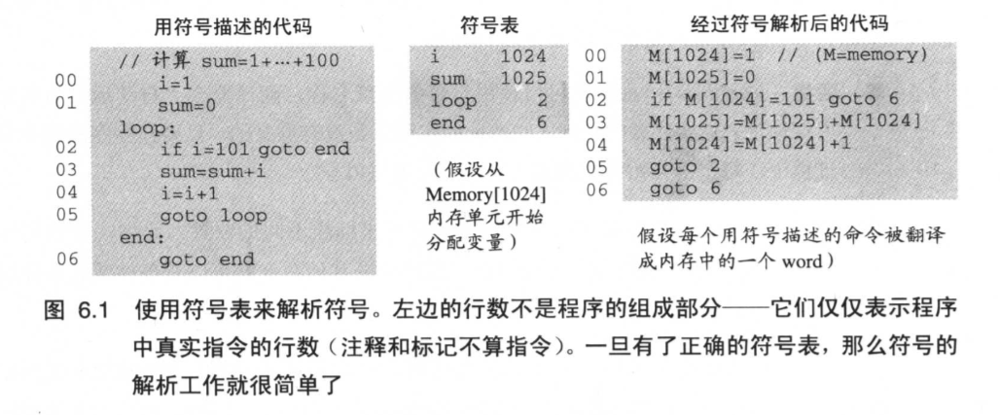

​	如上，符号表的各项键值对 对应了源代码中的自定义符号。只是最后一句需要解释一下，代表了无限循环`end:  goto end`.

​	其中，有3个要点需要说明。

1. 我们定义的变量分配的规则决定了能运行的程序**最多**只能有1024条指令。为了不使实际程序（如操作系统）**溢出**到符号表，存储变量的基地址应该**更远**一些。**(base address>>1024)**
2. **“每条源代码命令映射到一个字(word)”**的假设过于天真。一般情况下，某些汇编指令(`if i = 101 goto end `)会被翻译成几条机器指令，因此每条源代码会占据好几个内存单元。为了解决此问题，翻译程序会记录每条源代码产生的字的个数，然后相应的更新它的**“指令内存计数器(Insvachion memory counter)”**.
3. 对于**“每个变量用一个单一的内存单元来表示”**的假设可能也不实际。编程语言支持**多种类型的变量**，各自占用着**不同的内存空间**。因此，当为变量分配内存空间时，翻译程序必须考虑他们的**数据类型**和**硬件内存单元的宽度**。


#### 2.汇编编译器(Assembler)

​		汇编编译器将汇编程序翻译成计算机的二进制机器语言，才能被计算机执行。生成的代码被加载到计算机的内存中然后被硬件执行。

​		可见，汇编编译器实际上主要是个文本处理程序，设计目的是提供翻译服务。因此我们要有完整的汇编语法说明文档和相应的二进制代码。有了这样的约定（通常称为机器语言规范），让每个符号命令执行下面的任务：

- 解析出符号命令内在的**域**。（解析）

- 对于每个域，**产生**机器语言中相应的**位域**。（代码生成）

- 用内存单元的**数字地址**来**替换**所有的**符号引用**。（符号处理）

- 将二进制码**汇编**成完整的机器指令。（汇编）

  其中三个任务（解析、代码生成和汇编）是相当容易实现的。而符号处理则相对复杂，是汇编编译器的主要功能。(——符号表)


### [Hack 汇编到二进制的翻译规范详述]

​		总的来说，Assembler是一个翻译挑战，从源语言到目标语言。为了做到这点，我们必须知道两种语言的语法。

#### 1. 语法规约和文件格式

**文件名称**		习惯上，二进制机器码程序后缀名为“Hack”，汇编代码程序的后缀名为“asm”。因此，Prog.asm文件会被汇编翻译器翻译成Prog.hack文件。

**二进制代码(.hack)文件**		二进制代码文件由**文本行**组成。**第一行由16个0/1组成的ASCⅡ码构成一个序列，该序列对一个单一的16-位机器语言指令进行编码**。当机器语言程序被**加载**进计算机的**指令内存**中时，文件的**第n行二进制码**被存储到**地址为n**的指令内存单元内（设命令行的技术和指令内存的起始地址都是从0开始）。	


**汇编语言(.asm)文件**		由**文本行**组成，每一行代表一条**指令(instrution)**或者一个**符号声明(symbol declaration)**.

- **指令(Instrution)**		A-指令或C-指令
- **(Symbol)**		**该伪命令将Symbol绑定到该程序中下一条命令的地址上**。因为它并**不产生机器代码**，所以称之为**“伪代码(pseudo-command)”.**      (eg: (END))

（下面的语法仅适用于汇编程序）

**常数(constants)和符号(Symbols)**		常数必须是**非负**的，用**十进制**表示。用户定义的符号可以由字母、数字、下划线(_)、点(.)、美元符号($)和冒号(:)组成的字母序列，但是**不能以字母开头**。

**注释**		以两条斜线(//)开头的文本行，注释不会被计算机执行。

**空格**		空格字符和空行被忽略。

**大小写习惯**		**所有的汇编助记符必须大写**。用户**自定义**的符号和变量是**区分大小写**的。一般的习惯是，**标签(labels)大写**，**变量名称小写**。


#### 2. 指令

Hack计算机包含两种指令类型，分别称为**寻址指令(A-指令, Addressing Instrution)**和**计算指令(C-指令, Compute Instruction)**。指令格式如下：

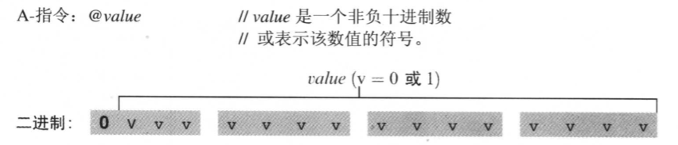

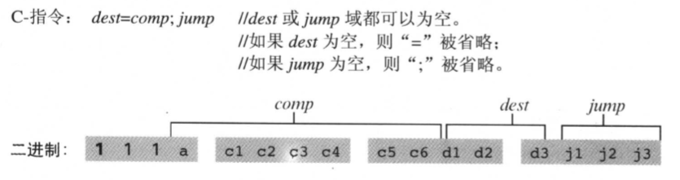


#### 3. 符号

Hack汇编命令通过使用**常数**或**符号**来指代**内存单元*(地址)***

> 从C6开始，若未经特殊说明，内存单元可以用名词“地址”代替，如变量Value的地址是0X5B46，这包含两层意思：
>
> 1）说明Value的物理地址是数值0X5B46；
>
> 2）**Value代表的变量存储在地址为0X5B46的内存单元中**。
>
> MOV  AX，Value   等价于  MOV  AX，(0X5B46)


汇编程序中的符号来源于三个方面。

**预定义符号(Predefined Symbols)**		任何Hack程序允许使用下面的预定义符号。

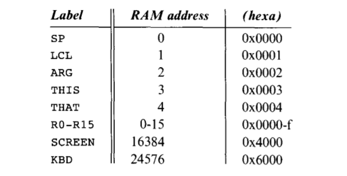

**标签符合(Labels Symbols)**		伪命令(Xxx)定义符号Xxx来指代存有程序中下一条命令在指令内存中的地址。每个标签只能定义一次，可以在任何地方使用，甚至在定义之前。有两种实现方法：

1. 先存储Symbol到符号表(但不知道它在哪里)，当真正遇到正确地址的定义时补上。

2. 第一次遍历程序的Labels和对应的位置，并存储在符号表，第二次遍历把Labels换成Address。(更简单)


**变量符号(Variable Symbols)**		任何出现在汇编程序中的符号Xxx，如果它**不是预定义符号也没有在其他地方使用(Xxx)命令**，那么它就被当作是变量。每遇到一个新的变量时，就把它**连续地映射到从16开始的内存中去**。


### [基本的汇编编译器逻辑]

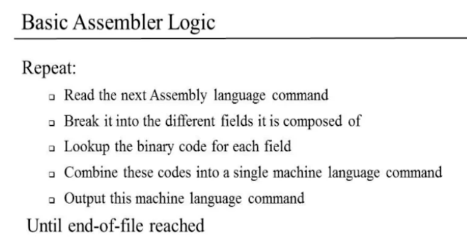

汇编编译器 **(Assembler模块)**循环执行：

- 从输入的文本文件中读取下一个汇编语言的命令（无需记住上一个命令）
- 把命令分为不同的部分
- 每个部分都可以用我们的语言指定的一种独特的方式翻译成二进制代码
- 将这些代码合并为一个机器语言命令（得到的二进制代码直接等同于汇编语言）
- 输出这个机器语言命令

循环直到 文末(EOF)


第一个问题：如何从输入的文本文件中读取下一个汇编语言的命令？

​		唯一的**困难**是我们可能需要跳过所有的注释、空格和空行。我们需要**确保**我们读**取了下一个命令，而不是注释、空格和空行**。

​		读取当前命令，并将其各部分放入某种字符串变量中，变成了一些我们以后可以处理的字符数组。


第二个问题：如何把命令分为不同的部分？

​		利用一些语法，把原来的字符串分成多个部分，其中涉及到一些简单的字符串操作。


第三个问题：如何把ASM翻译成二进制代码？


​		通过查询符号表根据**命令和符号**找到出对应的二进制代码，而数字则直接转换成二进制。


第四个问题：如何将二进制代码合并？

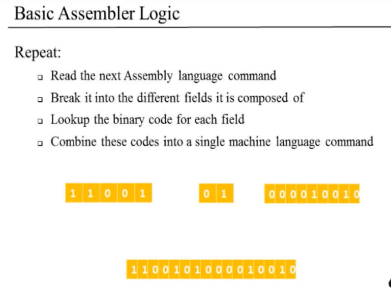


### [实现]

实现计划：

1. 我们将从编写一个基本的汇编程序开始，它可以处理那些没有符号的程序。（推迟对符号的处理，直接忽略所有的“空白”）
2. 我们将会发展出处理和使用符号的能力。
3. 最后，使用这个功能，我们会返回到基本的汇编程序**(1.)**，然后将其拓展为通用的汇编程序，它可以翻译任何给定的程序，用Hack汇编代码写成二进制代码。


#### 1.1 翻译A-指令

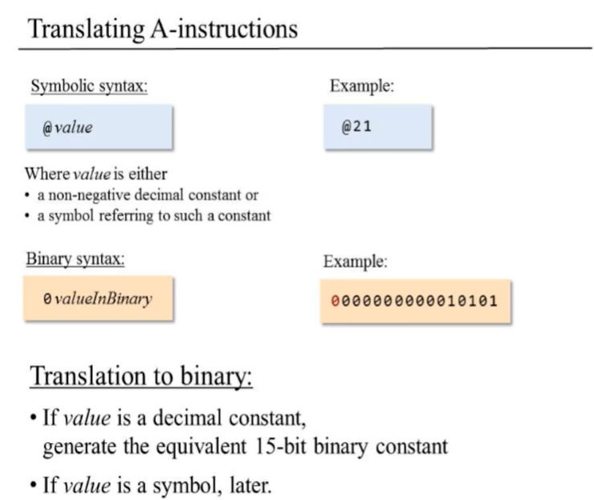

​		当`value`是非负的十进制常数，或者一个符号指向这样的常数时，就是A-指令。二进制语法`0-valueBinary`。

​		翻译成二进制码：

- 如果`value`是十进制常数，那么我们就计算该值的二进制码。为了把它变成一个15位的常数，我们需要加多少个0。
- 如果是`symbol`，迟点解决。


#### 1.2 翻译C-指令

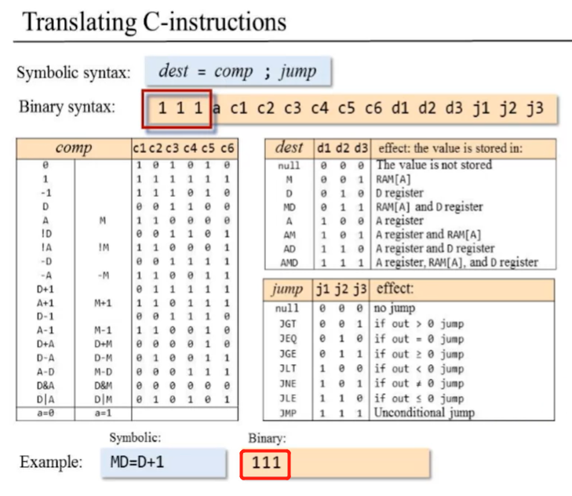

​		由汇编编译器的解析器，将C-指令分成`dest`、`comp`和`jump`三个部分解析。解析器会获得一个源语句或汇编指令，将它分为三个单独的字段，然后我们可以单独检查每个字段。

​		当设计到C-指令的二进制形式，我们初始化我们正构建的字符串开头有**3个`1`**；


​		接下来的7个位对应于`comp`域

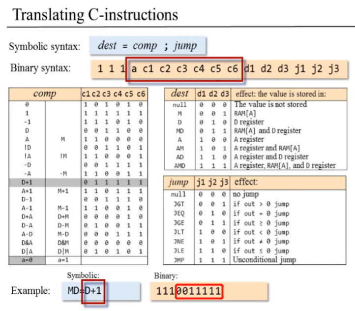

​		根据`D+1`在表中查询，可得`a=0, c=011111`，然后把它附加到我逐渐构建的字符串。


​		指令的下一个部分与目标相对应。

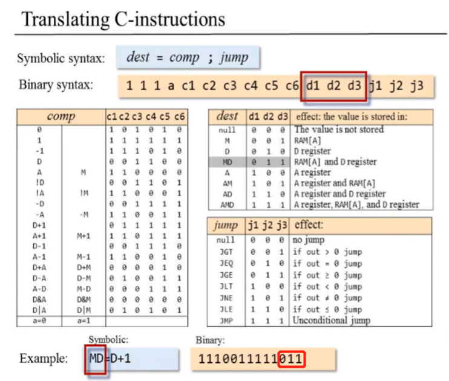

​		根据`MD`查询相关的表，可得`MD=011`，并将其附加到逐渐构建的字符串。


​		指令的最后一部分对应于跳转指令。

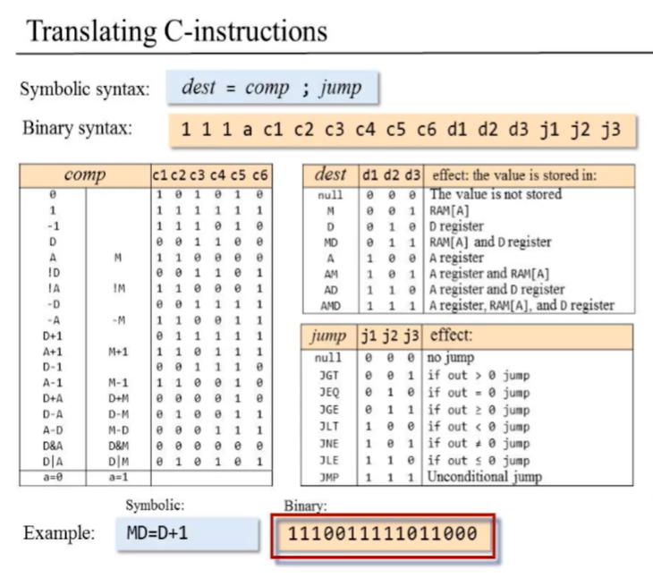

​		根据无跳转查询表，可得`null=000`，附加到字符串，最后构建完成汇编语句对应的二进制码。

​		正如上述，我们在这里所做的一切都是文本处理、字符串处理。我得到一个源字符串，通过特定的解析方式，我在一个渐进的过程中构建目标字符串，每一种高级语言都有执行字符串处理的能力。


#### 1.3 要构建的汇编器的完整逻辑

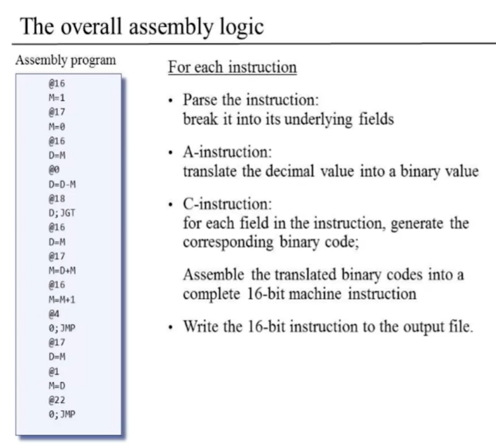

对于每个指令：

- 解析指令：将它分成多个模块。A-：`0-value`；C-：`111a cccc ccdd djjj`

- A-指令：将十进制常数翻译成二进制码；

- C-指令：生成指令中各个域对应的二进制码；

  将翻译好的二进制码汇编成16-位的机器指令

- 将16-位的机器指令写入输出文件。


### [开发一个Hack汇编器]

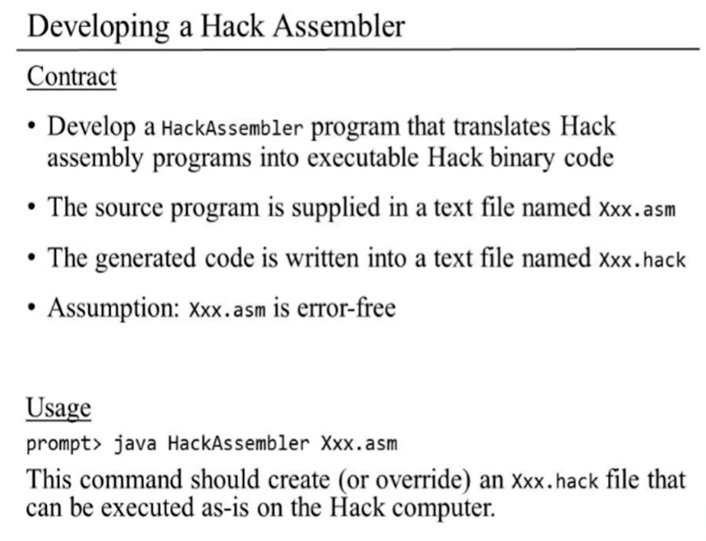

规定：

- 开发一个Hack汇编编译器程序，将Hack汇编程序翻译成可执行的Hack二进制码
- 源程序写在后缀为`Prog.asm`的文本文件中
- 生成的二进制码写入到后缀为`Prog.hack`的文本文件中
- 假设：`Prog.asm`无错误检测

用法：

命令行语法。该命令应该创建（或覆盖）一个可原封不动在Hack计算机中执行的`Xxx.hack`文件。


​		构建编译器分为两个阶段。第一阶段，编写汇编编译器(**Paeser模块**和**Code模块**)来翻译**无符号汇编程序**。第二阶段，拓展成为具有**符号处理能力**的汇编编译器。

#### 1. 无符号程序的汇编编译器

- 输入的`Prog.asm`程序不包含符号。A-指令`@Xxx`必须是十进制非负常数，不能是符号。
- 不能包含符号命令，`(Xxx)`不可用。

1. 打开名为`Prog.hack`的输出文件
2. 开始处理`Prog.asm`文件的每一行汇编指令  (Loop)
   - 对于C-指令，程序将翻译后的指令域的二进制码连接到一个单一的16-位字上，并将其写入`Prog.hack`文件
   - 对于A-指令，程序将语法分析器返回地十进制常数翻译成对应的二进制表示，并将得到的16-位字写入`Prog.hack`文件

*Parser.java*

```java
// 处理.asm文件的指令  eg: @常数, AMD comp JGT/..  (AMD=)(comp运算)(;JGT/...), (Symbol)
class Parser { 
    // 扫描器(Scanner对象)存储输入流，准备语法分析
    // String对象存储当前行的指令
    // 构造器：为汇编编译器构造语法分析器的实例，传入Scanner对象(而Scanner对象由汇编编译器需要编译的文件构造)
    // API:
    // boolean hasMoreCommands(): 扫描器.hasNextLine()
    // void advance(): 当前指令.nextLine
    // enum commandType: 三种指令类型
    // void skipSpacesAndComments(): 注释:subString()截掉'//'之后的内容, 空白:replace()替换所有空格和制表符
    // int Length(): 当前指令长度
    // CommandType CommandType(): 根据当前指令，返回判断得出的指令类型。判断出A-指令和伪指令，剩下的就是C-指令
    // C-指令 API
    // String dest(): 将当前指令分割，返回当前C-指令的dest助记符
    // String comp(): 将当前指令分割，返回当前C-指令的comp助记符
    // String jump(): 将当前指令分割，返回当前C-指令的jump助记符
    // A-指令 API
    // String symbol(): 直接返回@之后的内容，无符号时必为非负十进制常数
    // void close(): 关闭资源
}
```

*Code.java*

```java
class Code {
    // C-指令
    // comp域
    // HashMap<String, String>对象，存储comp域助记符到二进制码的转换表
    // String comp(): 错误处理,若HashMap对象不存在该comp域指令. 存在则根据HashMap返回comp域助记符**对应的二进制码**
    // dest域, 无需表格
    // void checkDest(): 根据dest域助记符判断是否需要存储到寄存器，并往对应的二进制码添加(0/1)
    // String dest(): 用StringBuilder对象存储dest二进制形式，调用checkDest()得到dest正确的二进制表达式，并返回
    // jump域
    // String jump(): 根据jump域助记符，返回jump对应得二进制表达式
    // A-指令
    // String binary(): 对常数的大小进行错误判断，根据十进制常数返回二进制的对应形式，并填充0直至二进制码为15位
}
```

*Assembler.java*

```java
class Assembler{
    // Parser getParser(): 根据文件名创建Parser对象
    // boolean isValidName(): 判断文件是否为.asm文件
    // int getInt(): 返回字符串对应的十进制常数
    // main(): 
    // 1.解析命令行: (java 包名/类名 .asm文件位置)
    //                                (0)
    // 2.错误处理，命令参数必须是是两个，文件必须是.asm文件; 获得文件名
    // 3.根据文件名实例化Parser对象
    // 4.创建同名的输出流文件.hack，并存储在PrintWriter对象
    // loop
    // 5.循环利用parser解析指令，当前输入还有更多指令时，指令跳向下一行，跳过所有的"空白"，(如果此时指令长度为0，则下一个循环)，否则，创建出Parser对象的CommandType类型对象.
    // 6.根据CommandType对象，进行三种指令的处理
    // C-指令：3个区域分别用Code调用类静态方法，获取3个区域的二进制码，并往输出流对象PrintWriter写入"111 comp dest jump"
    // 伪指令：不处理
    // A-指令：用Code调用类静态方法获取A-指令的二进制码，并输出流对象PrintWriter写入"0 binary"
    // 如果Parser对象判断还有指令则创建新行
    
    // 关闭资源
}
```


#### 2. 完整的汇编编译器

##### SymbolTable模块

​		因为Hack指令可能包含符号，作为翻译的一部分，必须为这些符号确定**实际的地址**。

​		我们用**符号表(symbol table)**来完成，符号表用来建立和维护符号与地质之间的关联。**哈希表(hash table)**就是表示这种关系的经典数据结构之一。

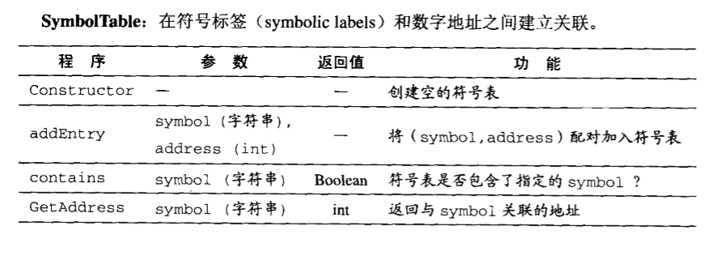


##### 有符号程序的汇编编译器

​		有效的方法之一是，从头至尾地读取两次代码。

​		Hack语言有三种类型的符号：预编译符号(predefined symbols)，标签(labels)和变量(variables)。符号表应该包含并处理所有这些符号。

​		**初始化**		创建符号表；根据下表，用所有预定义符号和他们预分配的RAM地址对符号表进行初始化。

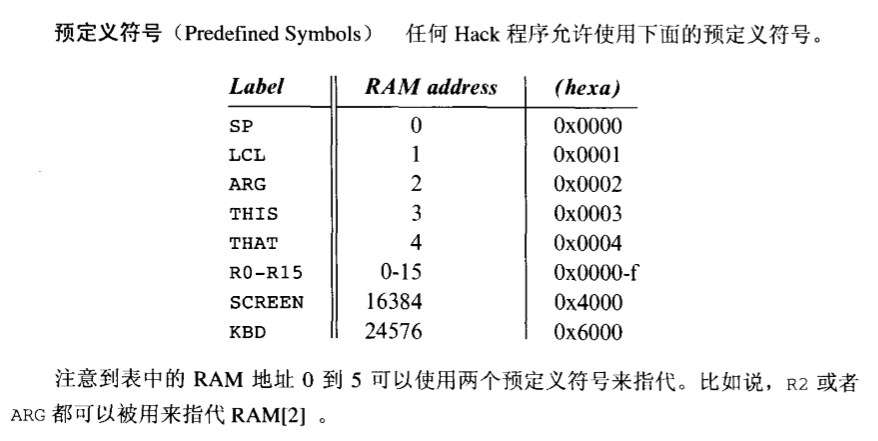


​		**第一遍读取阶段**		该阶段主要是**在符号表建立每条命令及其对应的地址**。处理程序的每一行时，利用数字来记录ROM地址——当前指令最终将被加载到这个地址中。每次遇到一条**伪指令*(Xxx)***时，在**符号表**上加一个新条目来**将*Xxx*与最终用于存储程序中下一条指令的ROM地址关联**。此阶段所有标记和他们的ROM地址被加入到符号表中。

​		**第二遍读取阶段**		重新对每一行指令进行语法分析，每次遇到**符号化A-指令**，就在符号表中查找***Xxx***。如果在符号表中找到了该符号，就**用其对应的地址来替换该符号与完成指令的翻译**。如果在符合表中**没找到该符号**，那么它必定代表**变量**。为处理这个变量，**在符号表中添加*(Xxx, n)*，这里*n*代表下一个可用的个RAM地址**。分配的RAM地址是连续数字，从地址16开始。(紧接着预定义符号之后)

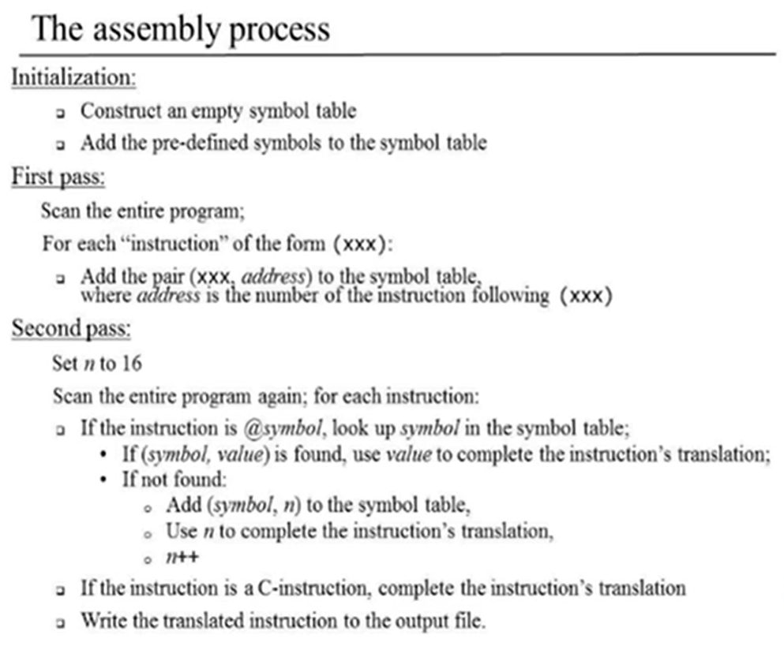

*Parser.java*

```java
class Parser{
    // Modify
    // String symbol(): 增加@Variable和(Symbol)的处理。@..返回处理统一，不变；而(Symbol)，只返回Symbol
}
```

*SymbolTable.java*

```java
class Symboltable{
    // 符号表：HashTable<String, Integer>
    // 当前更新变量的地址：16(init)
    // SymbolTable(): 初始化HashTable，并初始化预定义的符号
    // void addEntry(String symbol, int address)
    // boolean contains(String symbol): 是否包含Key
    // int getAddress(String symbol): 根据Key获得Address
    // int getNextAddAndIncrement(): 获取当前更新变量的地址，并令地址加1
}
```

*Assembler.java*

```java
class Assembler{
    // Add
    // 添加第一次遍历：主要是构建符号表，将伪指令添加到符号表
    // 记录当前命令被加载到的地址
    // loop
    // 1.循环利用parser解析指令，当前输入还有更多指令时，指令跳向下一行，跳过所有的"空白"，(如果此时指令长度为0，则下一个循环)，否则，创建出Parser对象的CommandType类型对象.
    // 如果指令类型是伪指令，将(符号,当前程序指令地址+1)添加到符号表; 否则当前程序指令地址自增
    // 关闭parser资源
    
    // Modify
    // int getInt(String input, SymbolTable symbolTable): 当input是符号化常数，转换为int并返回; 若不是，处理数字格式异常，(只能是 预定义变量 / 用户自定义变量).
    // - 预定义变量: 返回 根据input符号返回符号表对应的地址
    // - 用户自定义变量: 将(符号，符号表中的当前更新变量的地址)，并返回地址
}
```

