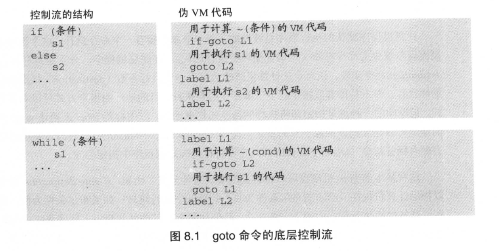
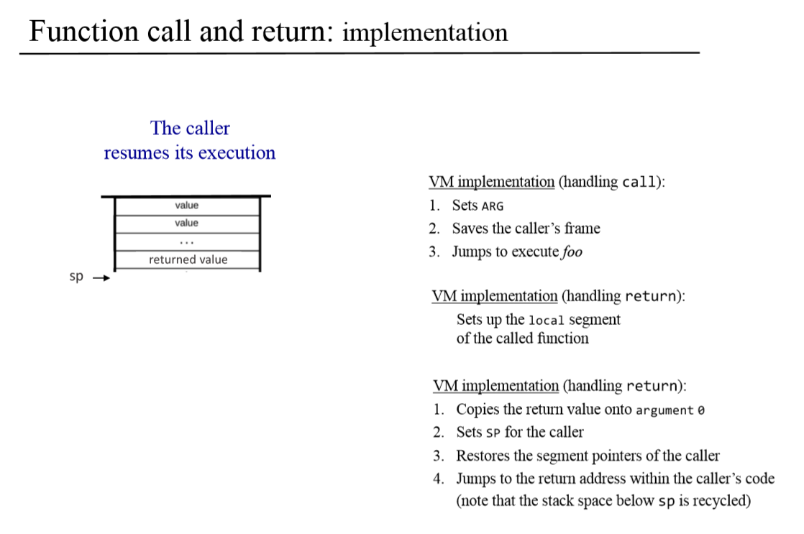
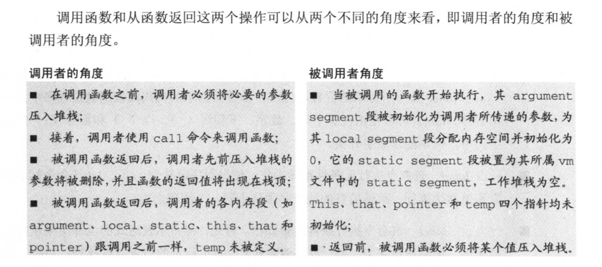
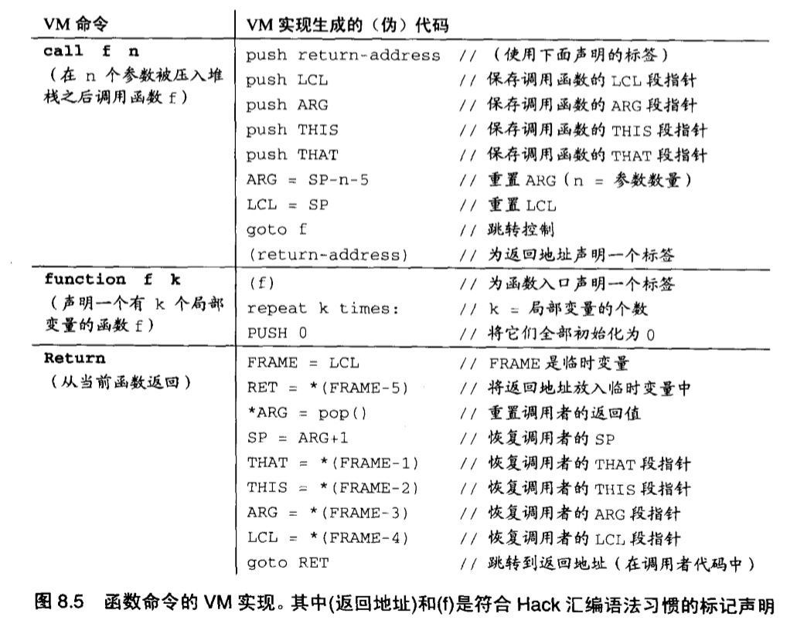
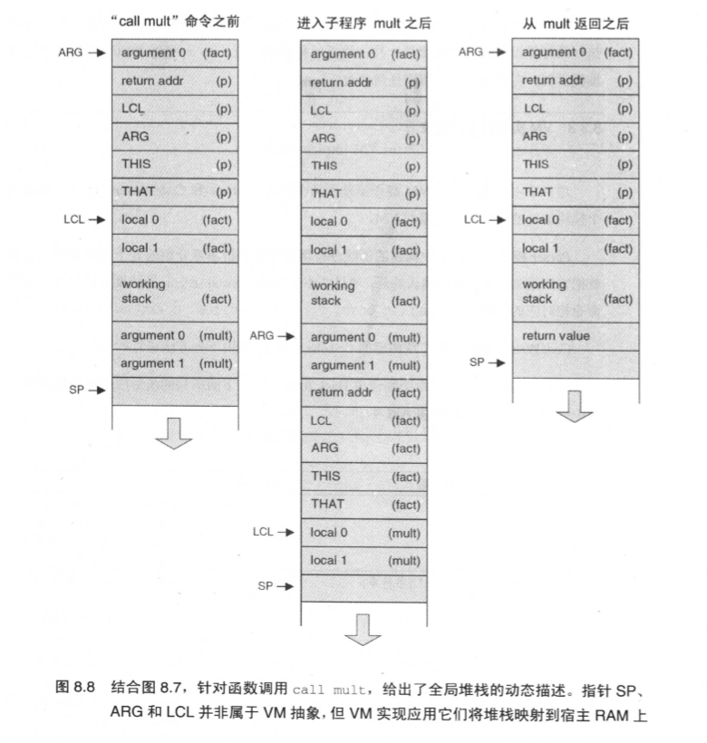
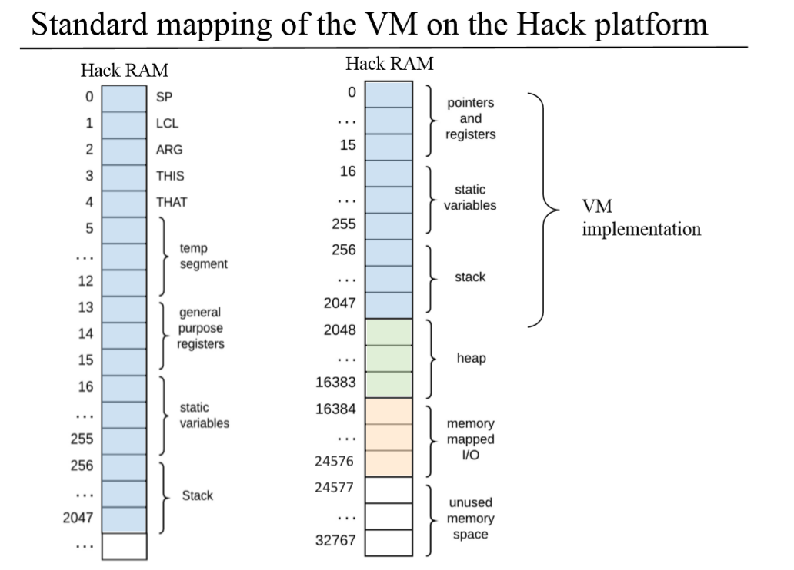
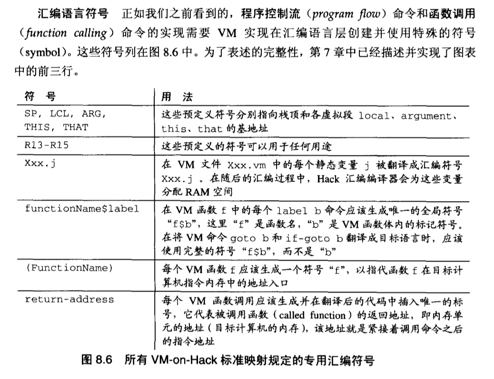

# [虚拟机Ⅱ: 程序控制 Program Control]

### [背景知识]

上一章介绍9个算术指令、逻辑指令以及内存访问指令(push/pop segment<8> index)是如何利用基本**栈式机(stack machine)**操作来进行计算的。本章将在上章基础上描述**程序控制流(program flow)命令**和**子程序调用(subroutine calling)命令**是如何在**栈式机**实现的。

对于在运行期的每个**子程序调用**，底层必须处理下面的一些细节。可以利用**栈式机**来方便的完成，事实上**栈式结构**本身的优势就在于处理类似的问题。

- 将参数从调用者(caller)传递给被调用者(called subroutine)。（参数传递）
- 在跳转并执行被调用者之前，先保存调用者的状态。（现场保护）
- 为被调用者使用的局部变量分配内存空间。（内存分配）
- 跳转并执行被调用者。（子程序执行）
- 将被调用者的运行结果返回给调用者。（参数传递）
- 在从被调用者返回之前，回收其使用的内存空空间。（回收调用空间）
- 恢复调用者的状态。（恢复现场）
- 返回到调用语句之后的下一条语句继续执行。


### [程序控制流]

​		主要有两种，**无条件跳转**和**有条件跳转**，这部分是很容易实现的。上一章VM的原始操作是如何计算任意给定的布尔表达式，并将其结果置于栈顶的。这种表达式与`goto`和`if-goto`命令相结合，就可以表示任何编程语言中的任何控制结构的流程。




### [子程序调用]

​		子程序调用主要包含两种，调用内置指令和调用用户自己定义的子程序。调用内置指令，比如：`add`，`sub`等，在第7章都已经实现。调用用户自己定义的子程序与调用内置指令的区别在于需要使用关键字`call`。





#### 如何实现嵌套调用和递归调用的内存管理机制？

​		主程序会调用子程序，子程序还会调用子程序，子程序也会调用子程序自身，这就形成了**嵌套调用**和**递归调用**。
​		这里要介绍一个概念：**帧**，它表示**子程序的局部变量的集合**。在这一章中，栈是指全局栈结构，它**包括所有子程序的帧组成的栈**，包含了第7章中介绍的栈结构，但又大于之前的栈结构。


#### 函数调用协议(规范)




- 虽然子程序调用链可以具有任意深度，可以有任意的递归，但是**在任何时刻，只有调用链顶部的子程序才能被执行**，而处于调用链中其他子程序将一直等待到该子程序执行完毕才能继续执行。子程序调用的实现过程中，这种**后进先出**的处理方式和**栈区**数据结构的操作方式吻合。


#### ✨✨✨函数调用协议的实现

- 函数调用协议及其对应的全局栈区结构能够通过执行下图中给出的(用Hack汇编代码写出的)伪指令在Hack平台上实现。（CodeWriter的实现部分）




- 下图显示了三个调用相关的栈区状态：




#### Hack平台的RAM标准映射






## [实现]

*Parser.java*

```java
// 基于Chap7，追加实现解析本章新增的6个VM指令
```

*VMTranslator*

```java
// 在遍历Parser的数组链表之前增加指示: .asm是否已写入bootstrap程序代码
// 在遍历过程中，若程序并未写入bootstrap，调用函数并置指示为true
```


将VM程序代码翻译成ASM汇编代码

```haxe
// 标签
`label LOOP
(LOOP)

// 无条件跳转
`goto LOOP
@LOOP
0;JMP

// 条件跳转
`if-goto END
@SP
AM=M-1
D=M
@END
D;JNE						// 不相等则跳转

// 函数调用
call functionName numArgs	// 根据上图8.5(call f n)的VM实现翻译
`call mult 2
@RETURN_ADD_index
D=A
@SP
A=M
M=D
@SP
M=M+1

```

*CodeWriter*

```java
class CodeWriter{
    // writeLabel(String): 写入label指令的汇编代码
    // eg:label LOOP -> (LOOP)
    // writeGoto(String): 写入goto指令的汇编代码，eg:goto LOOP -> @LOOP,0;jmp
    // writeIf(String): 写入if-goto指令的汇编代码，eg:if-goto
}
```


Reference: 

[jahnagoldman]: https://github.com/jahnagoldman

