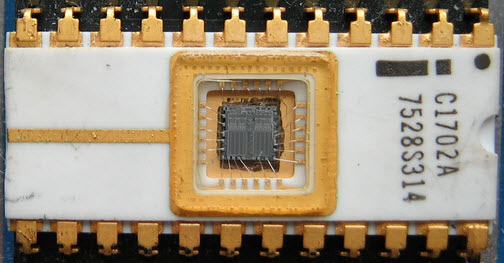

# RAM为什么是随机存储？

​		**”随机“强调的是存取数据所花的时间与目标数据所在的物理位置无关**。这是由RAM的结构决定的，RAM使用**存储阵列**来存储数据，只要给出**行地址**和**列地址**，就能**确定目标数据**，这一过程**与目标数据所处的物理位置无关**。

​		与“随机存取“相对的，是**“串行访问”**，指**存取数据所花的时间与目标数据所在的物理位置有关**。串行访问里面又分为**顺序存取**和**直接存取**。**顺序存取如磁带**，要想访问一个某一存储单元，**必须先访问该单元前面的单元**，（所以就有了听歌时倒磁带的痛苦经历）。**直接存取如磁盘**，磁头可以直接定位到目标存储单元，**不需访问该单元前面的单元**。需要注意的是，即使是直接定位，定位磁头所花的时间也是不同的，比如磁头当前在磁道0，定位到磁道2和磁道10000的时间肯定不同，所以存取数据所花的时间与目标数所在的物理位置仍然有关。

# 明明可以往硬盘里写数据，为什么叫ROM呢？

​		首先，**硬盘 ≠ ROM.**

​		在符合冯.诺依曼架构的计算机中，只读储存器ROM是相对于随机存储器RAM而存在的，**所有的预程序从ROM读出存储在RAM上，工作时程序均在RAM中运行**，而不是在ROM上，所以我们叫它只读储存器，**运行在RAM中的数据在断电前会保存在可多次擦写的外储存器上，外储存器才是硬盘**。

​		简而言之，对于计算机而言，从严格意义来讲**ROM是用来存储输入输出系统**，即**BIOS**，而**硬盘叫外储存器，用来存放操作系统软件以及程序与数据**。

​		对于手机而言，设定的Linux内核会**从磁盘中划分一部分储存空间作为ROM区，用于开机时读取到RAM的映像，而ROM区域和程序以及数据存储区域共用一个介质**，所以厂家为了简单宣传，会把整个ROM大小作为外储存器大小去宣传，但这个和PC是有一定区别的。

​		所以，**这也从结构上顺便解释了为什么安卓手机抑或Linux系统不容易中毒的原因，因为系统作为ROM中的单纯映像，不授权的话是无法写入的**，而Windows在外储存器以软件形式存在，且分界不明显，同时使用微内核结构桥接比较多，虽然方便更改系统配置但是对不熟悉者安全度低。

# EEPROM是一种“只读存储器”，为什么要对其进行写操作？

EEPROM的首字母缩写具有随着技术的发展而发展的历史。

**ROM**：只读存储器。写在工厂。

**PROM**：可编程只读存储器，但可由用户编程（一次）。真正的一次性可编程，永远可读的存储器。弄错了，就丢了芯片。

**EPROM**：可擦可编程只读存储器。可以写入多次，擦出需要使用紫外线照射。有点麻烦，但非常有用。

**EEPROM**：电可擦可编程只读存储器。可以写入多次，通过编程电压进行修改。

*图1. Intel 1702A EPROM，最早的EPROM类型之一，256 x 8位。石英小玻璃窗可吸收紫外线。资料来源：Wikipedia [EPROM](https://en.wikipedia.org/wiki/EPROM)。*

​		所以，为什么在可写时将其称为eepROm？我怀疑，答案是，与**RAM**（随机存取存储器）不同，它在电源关闭时会保存其内容，因此，其行为更像**ROM**。

​		后来推出的**闪存(Flash Memory)**技术，它是一种广义上的EEPROM，手机上的eMMC和UFS都属于闪存技术，因此闪存也被人们称为ROM。

# 「内存」这个名字误导性太强，为什么没有一个更精准上口的叫法？

​		在计算机专业领域，“内存”的全称是“内部储存器”，用于在运行时储存信息，CPU可以直接寻址，区别于永久保存数据、CPU仅通过硬件控制器读取数据的“外部储存器”。**这两者是从计算机架构的角度说的**。在通常语境下，“内存”只有主板上插的内存条一种，**内存就成了“主板上的RAM”的代称**。

​		RAM是Random Access Memory，随机访问储存器，特点是断电失效，可以直接通过电流刷新数据。现在一般只有内存条（DRAM）和CPU缓存（SRAM）使用这类芯片。

​		对应的ROM是Read-Only Memory，只读储存器，最开始的ROM真的是只读，不可写入，包括半导体ROM和CD-ROM，后来出现了紫外线擦除的EPROM，电擦除的EEPROM。

​		**RAM和ROM是从技术实现的角度说的**。

​		U盘、固态硬盘、手机固件使用的闪存芯片也是一种EEPROM，它依然是先擦除再写入，和RAM有原理上的区别。所以**手机广告上的2G RAM + 16G ROM是正确的用法**。（不要纠结flash到底是不是EEPROM了，它确实符合EEPROM定义，写入是通过电擦除-再写入实现的，不过EEPROM一般专指可以按字节擦除的那种，flash是按块擦除）

​		智能手机的组成和电脑一样，所以**依据部件功能继承了电脑的称呼**。不过硬盘换成了闪存芯片，所以手机里履行硬盘职能的部件可以被称作“闪存”。

​		内存和ROM混淆**我认为**来自于安卓系统（或者更早的塞班，我没用过），安卓文件管理器把手机空间分为“内部储存”和“SD卡”，这里的“内部储存”指的是ROM，但是也简称为“内存”。为了和这个“内存”做区别，RAM就变成了运行内存，“运存”。

所以对应关系如下：
**电脑：内存－硬盘**
**手机：RAM－ROM**
　　　**内存－闪存**
　　　**运存－内存**

​		至于把手机的“内存”又迁移回电脑上，指代硬盘，我只能说现在的年轻人……哎……